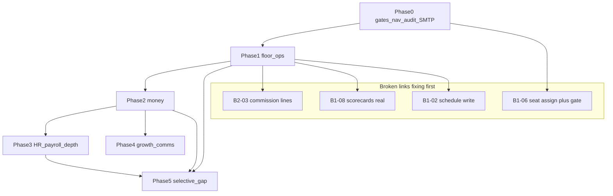

# Haus of Barber — Multi-Stage Flow Maps

**Source audit:** [haus-of-barber-audit.md](./haus-of-barber-audit.md)  
**Plan tickets:** [barber-phased-implementation-plan.md](./barber-phased-implementation-plan.md)  
**Rule:** A flow is **done** only when every stage is a real state transition with a test. No stage may rely on mocked/hardcoded data while earlier stages are presented as real.

**Legend**

| Marker | Meaning |
|--------|---------|
| ✅ | Real transition exists (may still need hardening) |
| ⚠️ | Partial / broken link — **first-class ticket required** |
| ❌ | Missing or fake — must build or hide from UI |
| `[TICKET]` | Ticket ID in the phased plan |

---

## Flow A — Booking lifecycle

```text
create → confirm → (reschedule | cancel) → check-in → service
    → checkout/payment → commission line written → audit log entry
```

| # | Stage | State transition | Current | Broken/fake link | Fix ticket |
|---|-------|------------------|---------|------------------|------------|
| A1 | **Create** | `bookings` row: status `pending`/`confirmed`, services + staff + customer linked | ✅ | Wizard depth / conflict QA risk | [B1-04] |
| A2 | **Confirm** | status → `confirmed` | ✅ | — | — |
| A3a | **Reschedule** | `starts_at`/`ends_at` update; conflict re-check | ⚠️ | Conflict load undertested | [B1-04] |
| A3b | **Cancel** | status → `cancelled`; free chair slot | ✅ | Cancellation fee / policy missing | [B5-01] (Phase 5) |
| A4 | **Check-in** | status → `checked_in` / `in_service` (or queue `in-chair`) | ⚠️ | Not always distinct from start-service | [B1-03] |
| A5 | **Service** | in progress until POS/complete | ✅ | Buffer minutes between chairs Gap-UI | [B5-02] |
| A6 | **Checkout / payment** | transaction posted; booking → `completed` | ⚠️ | Cash path Real; **Pesapal Stub** | [B2-01]; cash harden [B2-02] |
| A7 | **Commission line** | immutable `commission_lines` (or equivalent) per ticket | ❌ | Period summary only; **no atomic line on sale** | [B2-03] |
| A8 | **Audit** | append-only `audit_log` for create/cancel/pay/commission | ⚠️ | Not all mutations logged | [B0-06], reinforced in money tickets |

**Done when:** E2E creates booking → completes cash checkout → commission line appears for assigned barber → audit has create + payment + commission events. No hardcoded commission %.

---

## Flow B — Walk-in queue

```text
add walk-in → waiting → in-chair → done → feeds commission + scorecard
```

| # | Stage | State transition | Current | Broken/fake link | Fix ticket |
|---|-------|------------------|---------|------------------|------------|
| B1 | **Add walk-in** | create today’s booking with walk-in flag (or queue entity) via one-tap | ⚠️ | Derived from bookings; one-tap UX weak | [B1-03] |
| B2 | **Waiting** | visible on board; est. wait computed | ⚠️ | Est. wait may be thin | [B1-03], better: [B1-03b] |
| B3 | **In-chair** | status advance; barber assigned | ⚠️ | Tied to check-in | [B1-03] |
| B4 | **Done** | complete → POS/checkout same as A6–A8 | ⚠️ | Must share payment + commission path | [B2-01], [B2-03] |
| B5 | **Scorecard feed** | completed walk-ins count in barber tickets/revenue | ⚠️ | Scorecard punctuality/retention **hardcoded** | [B1-08] |

**Done when:** E2E: reception adds walk-in without UUID → advances waiting→in-chair→done → cash checkout → barber scorecard ticket count increments from DB (not demo).

---

## Flow C — Staff lifecycle

```text
invite → accept → schedule assigned → chair/seat assigned (if rental)
  → active work (attendance, commissions, tips)
  → time-off requests
  → offboarding (deactivate → revoke → reassign clients
                 → cancel/reassign future bookings → end seat rental)
```

| # | Stage | State transition | Current | Broken/fake link | Fix ticket |
|---|-------|------------------|---------|------------------|------------|
| C1 | **Invite** | invite token + role; email | ⚠️ | Needs prod SMTP | [B0-05] |
| C2 | **Accept** | membership + staff row linked to `user_id` | ✅ | — | — |
| C3 | **Schedule assigned** | `staff_schedules` rows for week | ⚠️ | API CRUD; **FE display-only** | [B1-02] |
| C4 | **Chair/seat assigned** | `seat_rentals.staff_id` set | ⚠️ | FE no staff_id; **gate mismatch** §3 | [B1-06] (gates in same ticket) |
| C5a | **Attendance** | QR clock in/out → `qr_scans` | ⚠️ | Nav ungated vs `qr_clock` | [B0-01] |
| C5b | **Commissions / tips** | lines accumulate | ❌ / ⚠️ | Lines missing; tips gate mismatch | [B2-03], [B0-01], [B2-02] |
| C6 | **Time-off** | request → approve → block bookings | ❌ | Gap-UI only in prototype | [B3-01] |
| C7 | **Offboard** | `is_active=false`; revoke; ownership transfer; future bookings; end rental | ❌ | API soft-delete; **no FE wizard** | [B1-05] |

**Done when:** E2E invite→accept→manager sets schedule→(optional) chair assign→clock-in→complete sale with tip→offboard transfers clients and ends rental; each step audited.

---

## Flow D — Payroll cycle

```text
attendance + commission lines + tips (period)
  → payslip generated → export
```

| # | Stage | State transition | Current | Broken/fake link | Fix ticket |
|---|-------|------------------|---------|------------------|------------|
| D1 | **Accumulate attendance** | days/hours from QR | ✅ / ⚠️ | Not always wired into payslip formula | [B3-02] |
| D2 | **Accumulate commission lines** | sum immutable lines | ❌ | No atomic lines | [B2-03] (prereq) |
| D3 | **Accumulate tips** | tips ledger for staff | ⚠️ | Tips exist; gate; not always in payslip | [B2-02], [B3-02] |
| D4 | **Generate payslip** | payroll run row + payslip PDF/record | ✅ | Employee-only; chair renter unset | [B3-06] |
| D5 | **Export** | CSV/PDF for bureau | ⚠️ | Thin / no compliance export | [B3-06] |
| D6 | **Audit** | payroll run + export logged | ⚠️ | Must be AC of payroll tickets | [B0-06], [B3-06] |

**Done when:** Integration test: seed attendance + commission lines + tips → generate payslip → amounts match sum; export file non-empty; audit entries present. Chair-renter path settles rent, not salary ([B3-03], [B3-06]).

---

## Flow E — Client ownership

```text
booking → visit completed → ownership inferred/assigned
  → transfer with reason → audit
```

| # | Stage | State transition | Current | Broken/fake link | Fix ticket |
|---|-------|------------------|---------|------------------|------------|
| E1 | **Booking** | customer + preferred/assigned staff | ✅ | — | — |
| E2 | **Visit completed** | booking completed + transaction | ⚠️ | Same as A6 | [B2-01] |
| E3 | **Infer / assign** | `preferred_staff_id` or ownership record | ⚠️ | Read-heavy; mutations limited | [B1-04 ownership = B1-04o] → [B1-04] |
| E4 | **Transfer + reason** | ownership moves; reason required | ❌ | Not first-class | [B1-04] |
| E5 | **Audit** | transfer event | ❌ | Missing | [B1-04] + [B0-06] |
| E6 | **Better-on-top** | at-risk clients when barber offboards | ❌ | — | [B1-04b] |

**Done when:** E2E: complete visits under barber A → ownership shows A → manager transfers to B with reason → audit shows transfer; offboard triggers at-risk list ([B1-04b]).

---

## Cross-flow dependencies (must respect ticket order)



---

## Fake / stub presentation policy (per flow)

| Fake surface | Presentation choice | When made real | Ticket |
|--------------|---------------------|----------------|--------|
| Pesapal collect | Keep Stub **hidden** from claiming “paid” until live | Phase 2 | [B2-01] |
| OpenFloat disburse | Hide payout success theatre | Phase 2 | [B2-07] |
| SMS / WhatsApp send | Hide Send or dry-run only | Phase 4 | [B4-01], [B4-02] |
| Scorecard 85%/72% | Must not ship as truth | Phase 1 compute or drop | [B1-08] |
| Revenue forecast bookings=0 | Hide from barber nav or fix | Phase 0 hide enterprise-gated already; real in Phase 5 | [B0-01], [B5-06] |
| DialPad contacts | Hide softphone / enquiry-only | Phase 5 (or Phase 0 hide pad) | [B5-07], interim [B0-02b] |
| Payments demo | **Remove from barber nav** | Phase 0 | [B0-02] |
| Field operations | **Remove from barber nav** | Phase 0 | [B0-02] |
