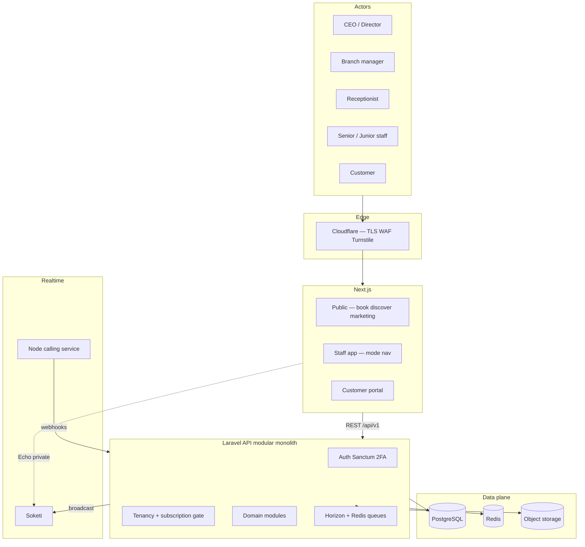
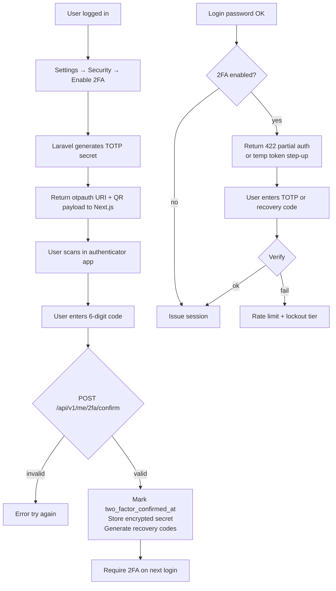

# Haus of Grooming OS — System overview

**Version:** 1.0 — April 2026  
**Classification:** Confidential  

This file is the **entry point**: product vocabulary, who sees what, how subscription and tenancy interact, and where to read next. Deep schema, API routes, and frontend module layout live in companion files ([01](./01-data-storage-and-schema.md), [02](./02-backend-api-and-services.md), [03](./03-frontend-modules-and-ux.md)).

---

## Product and module guide (how it fits together)

### What Haus of Grooming OS does

**Haus of Grooming OS** is a multi-tenant SaaS for barbershops, salons, spas, nail bars, aesthetics clinics, mobile field services, therapy practices, independent solo professionals, and product-first retail — under one platform. Each **Haus** (business mode) reuses the same core domain (organizations, branches, staff, services, customers, bookings, transactions) but changes **labels**, **default navigation sections**, and **which specialist screens appear** (e.g. clinical intake for clinic, coverage zones for mobile, session notes for therapy, `shop-orders` for products).

### How the systems connect (Phase 0 prototype vs production)

| Layer | Phase 0 (reference UI) | Production target (see [master plan](./full-stack-implementation-master-plan.md)) |
|--------|----------------------|--------------------------------------------------------------------------------------|
| UI | Vite + React Router, `AppLayout.tsx` | Next.js App Router |
| Auth / session | `useAuth` + client session (reference) | Laravel Sanctum (+ 2FA) |
| Data | Typed client → PostgreSQL (reference) | Laravel API + PostgreSQL + Redis (cache, queues, sessions) |
| Subscription / features | `useSubscription` → `subscriptions` table; `hasFeature(plan, key)` | Same feature keys; enforce on server |
| Nav per Haus | `getNavForMode(categories)` in `AppLayout.tsx` | Same idea: mode manifest + `me.features` |
| Business labels | `useBusinessCategory` → `MODE_TERMS`, `effectiveCategories` | Server-driven `business_type` + i18n |

**Call flow (conceptual):** browser → staff app shell or `/portal/*` → React pages → **HTTPS JSON** to Laravel `/api/v1/*` (production: Next.js + Laravel + PostgreSQL + Redis). The Phase 0 reference used a direct-to-DB client for UI exploration only. Realtime, M-Pesa webhooks, and calling bridge are specified in [02](./02-backend-api-and-services.md).

### Who can access the system

| Actor | How they sign in | What they see |
|--------|------------------|---------------|
| **CEO / Director** | Business auth | Full executive nav for their mode; billing, branches (if plan), reports, optional commissions/payroll |
| **Branch manager** | Business auth | Floor operations: schedule, bookings, staff/attendance, queue (mode-dependent) |
| **Senior / junior staff** | Business auth | “My work” routes: own bookings, schedule, earnings, clients, POS if feature |
| **Receptionist** | Business auth | Check-in, queue, schedule, POS (if `pos_payments`), payments demo |
| **Customer** | Customer / portal auth | **`/portal/*` only** — own bookings, loyalty, reviews, referrals, profile |
| **Solo / mobile entry** | Query params from `src/pages/PlatformsPage.tsx`, `PortalSelectPage.tsx` | `category=solo_pro` or `mobile` + optional `specialty=barber|beauty|…` stored for terminology |

Roles are `app_role` values in `user_roles` (see [01](./01-data-storage-and-schema.md)).

### How money works: two different “payers”

1. **Tenant → platform (SaaS subscription)**  
   Organizations pay **Haus of Grooming OS** via plans in `src/lib/pricing.ts`: **`solo_pro`**, **`starter`**, **`professional`**, **`enterprise`**, priced per **platform** (Barber, Beauty, …, Products) and billing cycle. `useSubscription` loads `subscriptions.plan` and status; `hasFeature` maps feature keys to minimum plan (e.g. `pos_payments` → Professional). Keep the `BusinessType` (or `business_type`) TypeScript type in sync with the DB enum if you add `solo_pro` / `products` to subscriptions.

2. **End-customer → tenant (in-venue / online)**  
   **POS**, **M-Pesa**, **cards/cash** as modeled in `transactions` and POS routes — staff and reception use `/pos`, `/reconciliation`, `/payments-demo` where present. This is **the business’s revenue**, not the SaaS fee.

3. **Staff compensation (inside the tenant)**  
   **My Earnings**, **Tips**, **Commissions**, **Payroll** (feature-gated) — see `/my-earnings`, `/tips`, `/commissions`, `/payroll` in nav for eligible modes/plans.

### How bookings work (shared logic, mode-specific words)

- **Data:** `bookings`, `booking_services`, `staff`, `services`, `customers`, `branches` — statuses such as `scheduled` → `completed` / `no_show` / `cancelled` (see enums in [01](./01-data-storage-and-schema.md)).
- **UI labels** come from `MODE_TERMS` in `useBusinessCategory.tsx` (e.g. “Appointment” vs “Session” vs “Home Visit”).
- **Flow:** staff create/change appointments on `/bookings` and `/schedule`; customers book via public **`/book`** and manage own list in **`/portal/bookings`**. Availability and conflict rules belong in the **API service layer** in production (see [02](./02-backend-api-and-services.md)).

### Shared modules (explain once — most Hauses)

These **routes** recur across modes with different sidebar **section titles**. Feature flags (e.g. `pos_payments`) still apply.

| Module | Typical paths | Purpose |
|--------|----------------|---------|
| **Dashboard** | `/dashboard` | Role-specific home: stats, shortcuts |
| **Bookings & schedule** | `/bookings`, `/schedule`, `/waitlist`, `/queue` | Calendar, walk-ins, queue |
| **Clients / guests / patients** | `/clients` | CRM, check-in |
| **Services & staff** | `/services`, `/staff` | Catalog, directory, assignments |
| **POS & money** | `/pos`, `/reconciliation`, `/payments-demo` | Take payment, reconcile (plan-gated) |
| **Inventory & retail** | `/inventory`, `/retail-products`, `/shop-orders`, `/suppliers` … | Stock, consumption, e-com orders (mode/plan dependent) |
| **Growth** | `/loyalty`, `/packages`, `/promotions`, `/referrals`, `/whatsapp`, `/gallery`, `/marketing` | Retention and marketing |
| **Operations** | `/tips`, `/staff-chat`, `/revenue-forecast`, `/field-operations` | Tips, chat, analytics, **field** (mobile-heavy) |
| **System** | `/settings`, `/notifications`, `/branding`, `/support` | Config, branding (Enterprise) |

For **full mode × role × path**, see [04](./04-navigation-matrix-by-mode-and-role.md).

### Per-Haus: what’s different (sidebar + emphasis)

Nav structures are **`BARBER_NAV`**, **`BEAUTY_NAV`**, **`SPA_NAV`**, **`NAIL_BAR_NAV`**, **`CLINIC_NAV`**, **`MOBILE_NAV`**, **`THERAPY_NAV`**, **`PRODUCTS_NAV`** in `src/components/AppLayout.tsx`. If **more than one** category is selected, the app currently uses **`BARBER_NAV` as the superset** (`getNavForMode`).

| Haus | Executive / floor flavour | Notable sections or labels |
|------|---------------------------|------------------------------|
| **Barber** | Executive, Branch, Reception, **My Chair** | Full queue/waitlist; chair rental; barber scorecards |
| **Beauty** | Salon Floor, **My Station** | Often more **Sales** links (inventory, reconciliation) in nav than barber |
| **Spa** | Spa Floor, **Front Desk**, **My Room**, Treatments, **Guest Experience** | “Sessions” wording; consent / allergies; fewer queue items in nav |
| **Nail bar** | Nail Floor, Queue emphasis | Nail art gallery; slimmer payroll/commissions in nav |
| **Clinic** | **My Practice**, **Clinical** | Patient intake, aftercare, liability; “Billing” POS |
| **Therapy** | **My Sessions**, **Clinical** | Session notes, progress tracking; session billing POS; room rental |
| **Products** | **Store Floor**, **Till**, **Sales Floor**, **Catalogue** | POS/till, **online orders** `/shop-orders`, stock, product gallery |

### Deep dive: Haus of Mobile (`mobile`)

- **Nav:** `MOBILE_NAV` — **Dispatch** (managers): routes, home visits, **Coverage Zones** (`/coverage-zones`), **Field Operations** (`/field-operations`). **My Hub** (field staff): visits, schedule, zones, earnings, portfolio, WhatsApp, loyalty, QR clock, team chat.
- **Terminology:** `MODE_TERMS.mobile` uses “Home Visit” and “Service Area”; but when only mobile is selected, UI can **borrow the specialty’s terms** via `mobileSpecialty` (barber, beauty, spa, nail_bar, clinic, therapy) — see `effectiveCategories` and `terms` in `useBusinessCategory.tsx` (mobile + specialty for filtering).
- **Dashboard:** For **mobile-only** org, `DashboardPage.tsx` swaps the default dashboard for **`MobileDispatchDashboard`** (management) or **`MobileSoloProDashboard`** (non-management staff) — field visit / route style UI with demo data.
- **Maps / zones:** Coverage and field ops are first-class routes; live map integration may evolve (DB/coverage_zones in schema).

### Deep dive: Haus of Solo Pro (`solo_pro`)

- **Not a separate `SOLO_PRO_NAV` in code** — `getNavForMode` has no `solo_pro` key, so navigation **falls back to `BARBER_NAV`** (same routes, barber-flavoured section names).
- **Entry:** `PlatformsPage.tsx`, `Navbar.tsx` — **Solo Barber, Solo Beauty, Solo Spa, …** with `category=solo_pro&specialty=…` so onboarding can set specialty.
- **Terms:** Dedicated `MODE_TERMS.solo_pro` (“Professional”, “Workspace”, “My Services”).
- **Pricing:** Dedicated **plan** `solo_pro` in `pricing.ts` (lower base than Starter) for the **Solo Pro platform** SKU.
- **Dashboard:** Uses the **standard** executive/staff dashboard — not the mobile visit dashboard (that is for **`mobile`** only).

### Deep dive: Haus of Products (`products`)

- **`PRODUCTS_NAV`:** Executive store analytics; **Store Floor** (POS, stock, **online orders** `/shop-orders`, attendance); **Till** and **Sales Floor** for cashier/associate; **Catalogue** (inventory, suppliers, price lock); Growth (loyalty, bundles, WhatsApp, product gallery).
- **Dashboard:** `DashboardPage` returns **`ProductsDashboard`** when category is **only** `products` (`isProductsOnly`).

---

## 1. One-page architecture

---

## 2. Business modes (feature names)

These values drive **terminology**, **default nav labels**, **service category filters**, and `subscriptions.business_type` (enum includes `both` for multi-category orgs).

| Mode key | Brand flavour (example) | Staff term | Client term | Booking term | Station / space |
|----------|-------------------------|------------|-------------|----------------|-----------------|
| **barber** | Haus of Barber | Barber | Client | Appointment | Chair |
| **beauty** | Haus of Beauty | Stylist | Client | Appointment | Station |
| **spa** | Haus of Wellness | Therapist | Guest | Session | Treatment room |
| **nail_bar** | Haus of Nails | Nail tech | Client | Appointment | Station |
| **clinic** | Haus of Aesthetics | Practitioner | Patient | Consultation | Treatment room |
| **mobile** | Haus of Mobile | Mobile pro | Client | Home visit | Service area / coverage |
| **therapy** | Haus of Therapy | Therapist | Client | Session | Session room |
| **solo_pro** | Haus of Solo Pro | Professional | Client | Appointment | Workspace |
| **products** | Haus of Products | Sales associate | Customer | Order | Aisle / shelf |
| **both** | Multi-service | Professional | Client | Appointment | Station / mixed |

**Frontend:** resolved from `GET /api/v1/me` → `subscription.business_type` and optional `organization.enabled_modes[]` for true multi-mode.  
**Backend:** stored on `subscriptions.business_type`; optional `organization_business_modes` join table if you split beyond a single enum.  
**Current implementation note:** frontend category maps include `solo_pro` and `products`; ensure DB enum/migrations are updated in production if not already present.

**Mode behavior nuance (current implementation):**
- `solo_pro` is modeled as a one-person operator experience with specialty entry variants (solo barber/beauty/spa/nails/clinic/therapy) at platform selection.
- `mobile` is modeled as a multi-specialty mobile umbrella: a `mobileSpecialty` is selected, and UI/data filtering uses an effective set of categories (mobile + specialty), with dispatch modules like coverage zones and field operations.

---

## 3. Application roles and “views”

Roles are stored in `user_roles` (one row per role assignment; production may add `branch_id` for scoped manager).

| Role key | Label (varies by mode) | Primary “view” |
|----------|------------------------|----------------|
| **ceo** | CEO | Executive — full org strategy, billing, all branches |
| **director** | Director | Same as CEO for product purposes |
| **branch_manager** | Branch / spa / clinic / practice manager | Single-branch operations: schedule, floor, QR attendance |
| **senior_barber** | Senior barber / stylist / therapist / practitioner / mobile pro | “My work” — own bookings, schedule, earnings, clients |
| **junior_barber** | Junior (same surfaces as senior) | Same as senior with policy differences if configured |
| **receptionist** | Reception / front desk / esthetician (spa label) | Check-in, queue, POS, light CRM |
| **customer** | Customer / guest / patient portal | `/portal/*` only |

**Executive simulation (prototype):** CEO/Director may impersonate a floor role via stored preference for UX demos; **production** should gate this behind explicit “support impersonation” audit if offered at all.

### 3.1 What each role can and cannot do (system-wide)

| Capability | CEO / Director | Branch manager | Receptionist | Staff (senior/junior) | Customer |
|------------|----------------|----------------|--------------|------------------------|----------|
| Change subscription / payment method | Yes | No | No | No | No (portal billing TBD) |
| Create / archive branches | Yes (Enterprise feature) | No | No | No | No |
| Org-wide financial reports | Yes | Branch-scoped only | No | No | No |
| Payroll / commissions export | Yes (Enterprise) | Configurable read | No | Own earnings only | No |
| Manage all staff profiles | Yes | Own branch | No | Self profile only | Self |
| POS / take payment | Yes | If licensed | Yes | If licensed | No |
| Create booking for any client | Yes | Yes | Yes | Own + assigned | Own (portal) |
| Delete org or hard-delete PII | Super-admin process | No | No | No | DSR request flow |
| API keys (Enterprise) | Yes | No | No | No | No |

### 3.2 What the organization can do vs platform (SaaS operator)

| Organization (tenant) | Platform (Haus of Grooming OS) |
|------------------------|--------------------------------|
| Configure services, staff, branches (within plan) | Define plan limits, enforce feature flags |
| Process M-Pesa for their clients | Hold Daraja credentials per tenant or aggregate (design choice) |
| Export their data | Run backups, migrations, incident response |
| Invite users and assign roles | Enforce max seats per plan |
| Customize branding (Enterprise) | Host CDN, apply abuse protection |

---

## 4. Subscription plans and feature gates

Plans: **starter**, **professional**, **enterprise** (see `useSubscription` / billing product).

| Feature key (API + UI) | Minimum plan | Staff routes affected (examples) |
|------------------------|----------------|-----------------------------------|
| `online_booking`, `client_management`, `basic_reports`, `email_support` | Starter | Core CRM, bookings, reports baseline |
| `pos_payments` | Professional | `/pos`, `/reconciliation` |
| `inventory_tracking` | Professional | `/inventory`, `/consumption`, `/price-lock`, `/suppliers` |
| `sms_reminders` | Professional | `/whatsapp` |
| `promotions_referrals` | Professional | `/promotions`, `/referrals` |
| `multi_branch` | Enterprise | `/branches`, chair/station rental |
| `staff_commissions_payroll` | Enterprise | `/commissions`, `/payroll` |
| `custom_branding` | Enterprise | `/branding` |
| `advanced_analytics` | Enterprise | `/scorecards`, `/call-centre`, `/audit-log` |
| `payroll` | Enterprise | `/payroll` (may align with commissions feature) |
| `api_access` | Enterprise | API key module (to be exposed in OpenAPI doc) |

**Frontend handling:** Next.js middleware or layout loader fetches `me.features`; route segments under `(dashboard)/enterprise/*` check both **role** and **feature**; show upgrade CTA if missing.  
**Backend handling:** Laravel `EnsureSubscriptionFeature` middleware on route groups; **never** trust `plan` from client body — re-read from DB or cache keyed by `organization_id`.

**Management bypass (prototype pattern):** optional product decision — if retained, executives still hit APIs that **re-check** policy server-side; bypass is UI-only.

---

## 5. Separation of concerns (frontend vs backend)

| Concern | Frontend (Next.js) | Backend (Laravel) |
|---------|---------------------|-------------------|
| Mode terminology | Reads `business_type` + i18n JSON | Stores source of truth on subscription/org |
| Nav visibility | Role + feature flags from `me` | Same rules in policies |
| Booking conflict UI | Calls availability endpoint, optimistic UI | `BookingService`, transactions, `check_staff_availability` |
| POS totals | Display + validation UX | Monetary rounding, tax, M-Pesa initiate, idempotency |
| Chat bubbles | Echo + render | Persist messages, authorize channel membership |
| Calls | Dialer UI, WebRTC | Node service + webhooks → `call_logs` |
| Images | `next/image`, CDN URLs | Signed S3 upload URLs, virus scan job optional |

---

## 6. Two-factor authentication (2FA) flow

Target: **TOTP** (Google Authenticator / Authy-compatible) + **recovery codes**, optional **SMS backup** (cost + SIM-swap risk — product decision).

**Storage:** `users.two_factor_secret` encrypted (Laravel `encrypted` cast); `recovery_codes` hashed like passwords; optional `trusted_devices` table with device fingerprint + expiry.  
**Redis:** rate limit key `login:2fa:{userId}`; lockout after N failures.  
**Admin recovery:** break-glass process with audit — second admin approval or support ticket.

---

## 7. Customer portal vs staff app

- **Customer** sees only `/portal` routes: home, bookings, loyalty, reviews, referrals, profile — data scoped to `customers.user_id = auth id`.  
- **Staff** sees dashboard shell with **mode-specific sidebar** (see [03](./03-frontend-modules-and-ux.md)).

---

## 8. Document map

| Topic | File |
|-------|------|
| Tables, columns, FKs, Redis, S3, sharding | [01](./01-data-storage-and-schema.md) |
| Laravel modules, APIs, booking/call/chat/auth flows | [02](./02-backend-api-and-services.md) |
| Next.js route groups, per-mode UI, SEO, caching, FE security | [03](./03-frontend-modules-and-ux.md) |
| Full nav: barber, spa, clinic, … × role × subscription | [04](./04-navigation-matrix-by-mode-and-role.md) |
| CI/CD, phases, infra scale | [full-stack-implementation-master-plan.md](./full-stack-implementation-master-plan.md) |
| Screen-level specs | [haus-of-grooming-system-blueprint.md](./haus-of-grooming-system-blueprint.md) |
| Doc index | [README.md](./README.md) |

---

© 2026 Haus of Grooming OS. All rights reserved.
