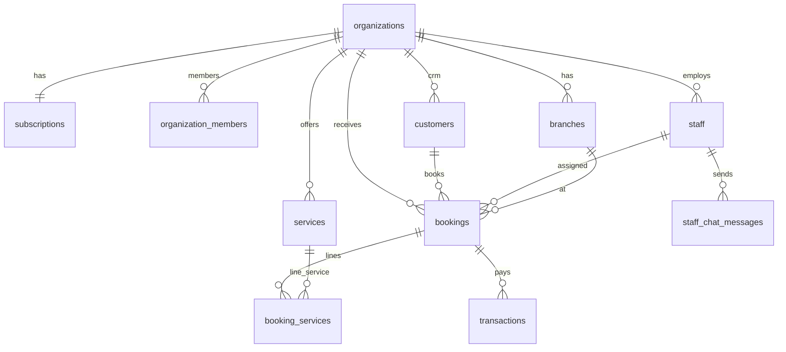

# Data storage, relational schema, and cache design

**Version:** 1.0 — April 2026  
**Companion:** [00-architecture-overview.md](./00-architecture-overview.md)  

Column lists below mirror the **Phase 0 generated / shared TypeScript types** (same domain as the reference UI). Laravel production migrations should **preserve or evolve** these shapes; add **`organization_id`** everywhere it is missing in types but required for tenancy (notably **`branches`** — types show no `organization_id`; production must add it). Add **`users`** fields for 2FA, API keys, and audit as needed.

---

## 1. PostgreSQL enums (public)

| Enum | Values |
|------|--------|
| `app_role` | `ceo`, `director`, `branch_manager`, `senior_barber`, `junior_barber`, `receptionist`, `customer` |
| `booking_status` | `scheduled`, `checked_in`, `in_progress`, `completed`, `no_show`, `cancelled` |
| `business_type` | `barber`, `beauty`, `both`, `nail_bar`, `clinic`, `mobile`, `therapy`, `solo_pro`, `products` |
| `loyalty_tier` | `bronze`, `silver`, `gold`, `vip` |
| `payment_method` | `mpesa`, `card`, `cash` |
| `payment_status` | `pending`, `completed`, `failed`, `refunded` |
| `subscription_plan` | `starter`, `professional`, `enterprise` |
| `subscription_status` | `trial`, `active`, `past_due`, `cancelled`, `expired` |

---

## 2. Tables — columns and relationships

**Convention:** `uuid` = UUID string. `timestamptz` / `date` / `time` = ISO strings in API. Money in **integer KES** unless noted.

### 2.1 Core tenancy and identity

**`organizations`**

| Column | Type | Notes |
|--------|------|--------|
| id | uuid | PK |
| name | text | |
| owner_id | uuid | FK → `users.id` (Laravel) |
| created_at, updated_at | timestamptz | |

**`organization_members`**

| Column | Type | Notes |
|--------|------|--------|
| id | uuid | PK |
| organization_id | uuid | FK → organizations |
| user_id | uuid | FK → users |
| created_at | timestamptz | |

**`subscriptions`** (1:1 with organization in current model)

| Column | Type | Notes |
|--------|------|--------|
| id | uuid | PK |
| organization_id | uuid | FK unique |
| plan | subscription_plan | |
| status | subscription_status | |
| business_type | business_type | Mode / combo |
| trial_ends_at | timestamptz nullable | |
| current_period_start, current_period_end | timestamptz | |
| mpesa_phone | text nullable | |
| last_payment_at | timestamptz nullable | |
| created_at, updated_at | timestamptz | |

**`profiles`** (1:1 with auth user id)

| Column | Type | Notes |
|--------|------|--------|
| id | uuid | = user id |
| full_name | text | |
| email | text nullable | |
| phone | text nullable | |
| avatar_url | text nullable | |
| branch_id | uuid nullable | FK → branches |
| created_at, updated_at | timestamptz | |

**`user_roles`**

| Column | Type | Notes |
|--------|------|--------|
| id | uuid | PK |
| user_id | uuid | |
| role | app_role | |

**`customers`**

| Column | Type | Notes |
|--------|------|--------|
| id | uuid | PK |
| organization_id | uuid nullable | FK |
| branch_id | uuid nullable | FK |
| user_id | uuid nullable | Portal link |
| full_name | text | |
| email, phone | text nullable | |
| notes, style_preferences | text nullable | |
| loyalty_points | number | |
| loyalty_tier | loyalty_tier | |
| referral_code | text nullable | |
| total_spent, total_visits | number | |
| last_visit_at | timestamptz nullable | |
| created_at | timestamptz | |

---

### 2.2 Locations, staff, services

**`branches`** — **add `organization_id uuid NOT NULL`** in production.

| Column | Type |
|--------|------|
| id | uuid PK |
| name | text |
| address | text |
| city | text |
| phone, email, description | nullable text |
| opening_time, closing_time | time / text |
| logo_url, cover_image_url | nullable |
| slug, whatsapp_number | nullable |
| is_active | boolean |
| created_at | timestamptz |

**`staff`**

| Column | Type | Notes |
|--------|------|--------|
| id | uuid PK | |
| organization_id | uuid nullable | FK |
| branch_id | uuid nullable | FK |
| user_id | uuid nullable | Link to login |
| full_name | text | |
| email, phone | nullable | |
| role | app_role | Display / default permissions |
| commission_rate | number | |
| specialties | text[] nullable | |
| bio, avatar_url, slug | nullable | |
| is_active | boolean | |
| created_at | timestamptz | |

**`services`**

| Column | Type |
|--------|------|
| id | uuid PK |
| organization_id | uuid nullable FK |
| branch_id | uuid nullable FK |
| name | text |
| category | text |
| description | text nullable |
| duration_minutes | number |
| price_kes | number |
| image_url | text nullable |
| is_active | boolean |
| created_at | timestamptz |

**`staff_schedules`**

| Column | Type |
|--------|------|
| id | uuid PK |
| organization_id | uuid nullable FK |
| staff_id | uuid FK |
| branch_id | uuid nullable FK |
| schedule_date | date |
| start_time, end_time | time |
| is_day_off | boolean |
| notes | text nullable |
| created_at | timestamptz |

---

### 2.3 Bookings and queue

**`bookings`**

| Column | Type |
|--------|------|
| id | uuid PK |
| organization_id | uuid nullable FK |
| branch_id | uuid nullable FK |
| customer_id | uuid nullable FK |
| staff_id | uuid nullable FK |
| service_id | uuid nullable FK |
| booking_date | date |
| start_time, end_time | time |
| status | booking_status |
| is_walkin | boolean |
| notes | text nullable |
| created_by | uuid nullable |
| created_at, updated_at | timestamptz |

**`booking_services`**

| Column | Type |
|--------|------|
| id | uuid PK |
| organization_id | uuid nullable FK |
| booking_id | uuid FK |
| service_id | uuid FK |
| staff_id | uuid nullable FK |
| price_kes | number |
| duration_minutes | number |
| sort_order | number |
| created_at | timestamptz |

**`waitlist`**

| Column | Type |
|--------|------|
| id | uuid PK |
| organization_id | uuid nullable FK |
| branch_id, service_id, staff_id | uuid nullable FK |
| customer_name | text |
| phone | text nullable |
| party_size | number |
| status | text |
| estimated_wait_minutes | number nullable |
| notes | text nullable |
| checked_in_at, served_at | timestamptz |
| created_at | timestamptz |

---

### 2.4 Commerce and inventory

**`transactions`**

| Column | Type |
|--------|------|
| id | uuid PK |
| organization_id | uuid nullable FK |
| branch_id | uuid nullable FK |
| customer_id, staff_id, booking_id | uuid nullable FK |
| amount_kes | number |
| payment_method | payment_method |
| payment_status | payment_status |
| mpesa_receipt | text nullable |
| description | text nullable |
| items | jsonb nullable |
| created_at | timestamptz |

**`tips`**

| id, organization_id, booking_id, customer_id, staff_id, amount_kes, payment_method, tip_date, notes, created_at |

**`inventory`**

| id, organization_id, branch_id, name, category, quantity, reorder_level, unit, unit_cost_kes, supplier, last_restocked_at, created_at |

**`retail_products`**

| id, organization_id, branch_id, sku, name, category, description, cost_kes, price_kes, quantity, reorder_level, image_url, is_active, created_at |

**`gift_cards`**, **`gift_card_redemptions`** — see types for full columns (code, balances, transaction link).

**`combo_discounts`**, **`promotions`**, **`service_packages`**, **`customer_packages`** — pricing and packages; all carry `organization_id`.

---

### 2.5 CRM, marketing, compliance

**`reviews`** — booking_id, customer_id, staff_id, organization_id, rating, comment, created_at  

**`referrals`** — organization_id, referral_code, referrer/referred customer ids, reward_kes, status, timestamps  

**`loyalty_rewards`**, **`enquiries`**, **`expenses`** — org-scoped  

**`consent_forms`** — title, form_type, content, customer_id, organization_id, signature_url, is_signed, signed_at, expires_at, created_at  

**`patient_intake`**, **`session_notes`**, **`progress_tracking`**, **`aftercare_instructions`**, **`coverage_zones`** — mode-specific clinical / mobile / therapy data; all include `organization_id` where applicable.  
**Products mode note:** prioritize `retail_products`, `inventory`, `transactions`, and optional `shop_orders`/fulfillment tables in Laravel migrations if e-commerce workflow is enabled.  
**Solo Pro note:** same core tables apply with lighter staffing/branch assumptions (typically single active professional seat).

---

### 2.6 Operations and realtime-adjacent

**`qr_scans`** — staff_id, branch_id, organization_id, scan_type, scanned_at, geo_lat/lng, verified, device_info, notes, created_at  

**`staff_chat_messages`** — organization_id, channel, sender_id, message, parent_id (thread), is_pinned, created_at  

**`notifications`** — user_id, organization_id, title, message, type, is_read, metadata jsonb, created_at  

**`audit_log`** — user_id, organization_id, action, entity_type, entity_id, details jsonb, ip_address, created_at  

---

### 2.7 DB functions (keep or reimplement in Laravel)

| Function | Purpose |
|----------|---------|
| `get_user_organization_id(uuid)` | Resolve tenant |
| `get_user_plan`, `get_user_business_type` | Subscription hints |
| `has_role`, `is_staff`, `is_management` | RLS helpers (optional if app-layer only) |
| `user_org_match` | Validate org id |
| `check_staff_availability(...)` | Booking conflict check |

---

## 3. Entity relationship (summary)

---

## 4. Redis usage

| Key pattern (example) | Purpose | TTL |
|----------------------|---------|-----|
| `sess:{id}` | Server-side session / token metadata | Session lifetime |
| `cache:org:{id}:services:v{n}` | Service catalog | 5–15 min + tag bust |
| `cache:me:{userId}` | Serialized `/me` | 30–60 s |
| `ratelimit:2fa:{userId}` | 2FA attempts | 15 min |
| `idempotency:mpesa:{checkoutRequestId}` | Payment callback dedupe | 7d |
| `lock:report:{org}:{job}` | Distributed lock | Minutes |
| Horizon queues | `default`, `notifications`, `integrations` | Until ack |

**Caching strategy:** write-through for money; cache-aside for catalogs; **no** cache of cross-tenant lists without org prefix.

---

## 5. Object storage (S3-compatible)

| Bucket / prefix | Content | ACL |
|-----------------|--------|-----|
| `branding/{org_id}/` | Logos, theme assets | Public read or signed |
| `receipts/{org_id}/` | Expense receipts | Private + signed GET |
| `gallery/{org_id}/` | Before/after | Configurable |
| `consents/{org_id}/` | Signatures / PDFs | Private |
| `exports/{org_id}/` | CSV/PDF exports | Signed short TTL |

---

## 6. Sharding, partitioning, read scale

1. **Default:** single PostgreSQL + **PgBouncer** + composite indexes `(organization_id, ...)`.  
2. **Partition:** append-only `audit_log`, `notifications` history by month.  
3. **Read replica:** reporting queries via second connection.  
4. **Shard (Citus / per-tenant DB):** only after sustained CPU / row-count SLO breaches — see [full-stack-implementation-master-plan.md](./full-stack-implementation-master-plan.md).

---

## 7. Laravel-specific additions (not in Phase 0 types)

| Table / column | Purpose |
|----------------|---------|
| `users` | Laravel default + `two_factor_secret`, `two_factor_recovery_codes`, `two_factor_confirmed_at` |
| `personal_access_tokens` | Sanctum API tokens (Enterprise) |
| `branches.organization_id` | Tenancy FK |
| `branding_settings` | From migration blueprint — org theme JSON |
| `call_logs` | Haus Connect — duration, provider ids, recording URL |
| `subscription_invoices` | Dunning / M-Pesa billing history |

---

© 2026 Haus of Grooming OS. All rights reserved.
