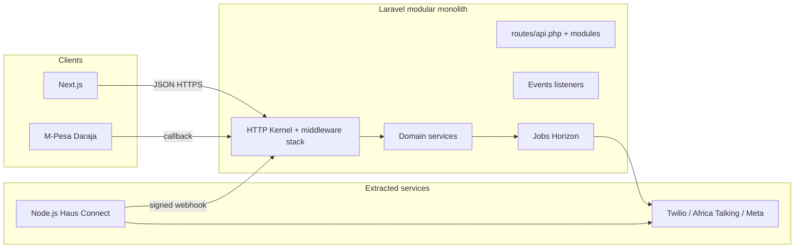
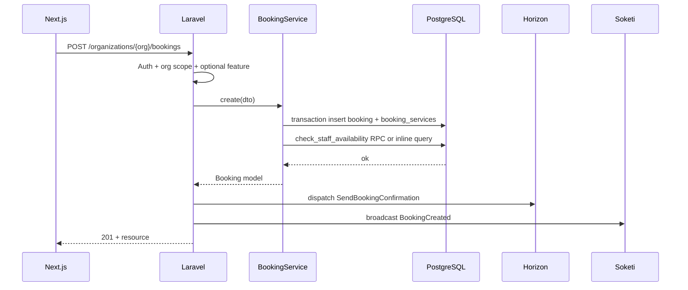
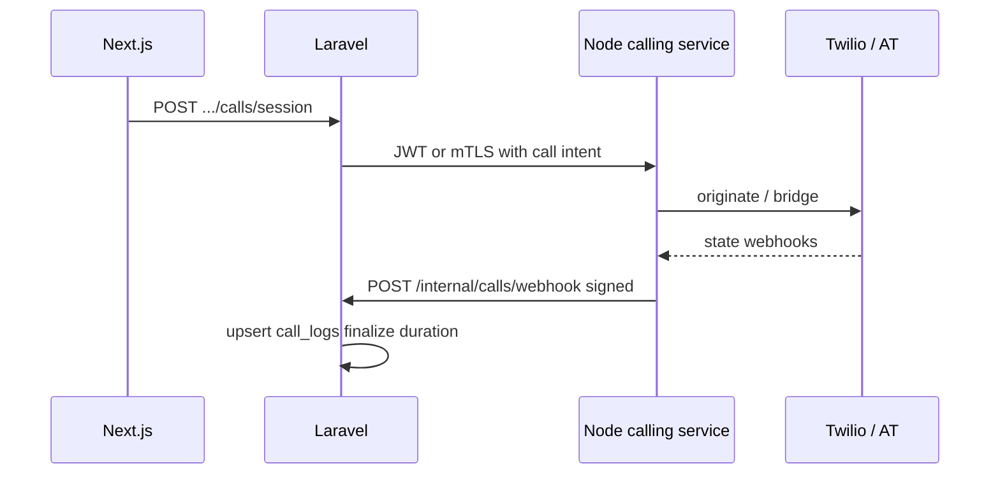
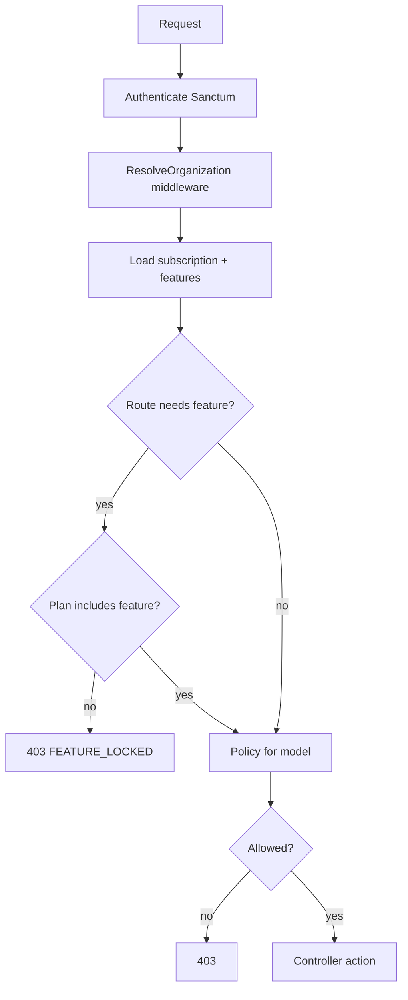

# Backend architecture, modular monolith, APIs, and data paths

**Version:** 1.0 — April 2026  
**Companion:** [00-architecture-overview.md](./00-architecture-overview.md), [01-data-storage-and-schema.md](./01-data-storage-and-schema.md)  

This document describes the **Laravel** application (modular monolith), the **extracted Node.js calling service**, **HTTP + webhook APIs**, and **how data moves** for critical features. Route names map to the **Phase 0 frontend** (`src/App.tsx`) so nothing from the current product surface is dropped.

---

## 1. Process topology

---

## 2. Laravel internal layers

| Layer | Responsibility |
|-------|----------------|
| **Routes** | Versioned `Route::prefix('v1')`; groups per middleware (`auth:sanctum`, `EnsureOrganization`, `EnsureSubscriptionFeature`) |
| **Controllers** | Thin — validate, authorize, delegate |
| **Form requests** | Input rules; never trust `organization_id` from body for privileged routes |
| **Policies + Gates** | Row-level authorization (org, branch, role) |
| **Domain services** | `BookingService`, `PaymentService`, `NotificationDispatcher`, etc. |
| **Models + global scopes** | `OrganizationScope` on tenant tables |
| **Events / listeners** | Decouple modules (`BookingConfirmed` → queue SMS) |
| **Jobs** | IO-heavy work; idempotent where payment-related |
| **Resources / API transformers** | Stable JSON shape for Next.js |

---

## 3. Module map (aligns with product)

| Module | Scope | Key tables |
|--------|-------|------------|
| Auth | Register, login, 2FA, password, Sanctum | `users`, `password_reset_tokens` |
| Tenancy | Orgs, members, branches | `organizations`, `organization_members`, `branches` |
| Billing | Plans, trials, webhooks | `subscriptions`, invoices |
| Booking | Calendar, walk-in, waitlist | `bookings`, `booking_services`, `waitlist` |
| Staff | Directory, schedules, QR | `staff`, `staff_schedules`, `qr_scans` |
| CRM | Customers, loyalty, referrals | `customers`, `loyalty_rewards`, `referrals` |
| POS | Transactions, M-Pesa | `transactions`, tips |
| Inventory | Stock, retail, suppliers | `inventory`, `retail_products` |
| Marketing | Promotions, packages, enquiries | `promotions`, `service_packages`, `enquiries` |
| Compliance | Consent, intake, notes | `consent_forms`, `patient_intake`, `session_notes` |
| Content | Gallery metadata | S3 keys in DB |
| Notifications | In-app + push to Soketi | `notifications`, broadcasts |
| Reporting | Aggregations, exports | read models / materialized views |
| Integrations | WhatsApp, SMS, AI | jobs + webhooks |
| Calling (bridge) | Receives Node webhooks | `call_logs` (add migration) |

---

## 4. REST API surface (representative)

Base: **`/api/v1`**. Authenticated routes use **Sanctum** (SPA cookie or Bearer).

### 4.1 Auth & session

- `POST /auth/register`, `POST /auth/login`, `POST /auth/logout`  
- `POST /auth/forgot-password`, `POST /auth/reset-password`  
- `GET /me` — user, roles, `organization_id`, `subscription`, `features[]`, `business_type`  
- `POST /me/2fa/setup`, `POST /me/2fa/confirm`, `DELETE /me/2fa`  
- `POST /auth/2fa/challenge` — step-up after password  

### 4.2 Organization-scoped CRUD (prefix examples)

`GET/POST/PATCH/DELETE /organizations/{org}/…`

| Frontend route (Phase 0) | Backend resource |
|----------------------------|------------------|
| `/dashboard` | `GET .../dashboard/summary?branch_id=&date=` |
| `/bookings` | `.../bookings` + nested `/bookings/{id}/transition` |
| `/services` | `.../services` |
| `/clients` | `.../customers` |
| `/staff` | `.../staff` |
| `/schedule` | `.../staff-schedules` |
| `/waitlist` | `.../waitlist` |
| `/queue` | `.../walk-in-queue` or filter on bookings |
| `/pos`, `/reconciliation` | `.../transactions`, `.../payments/mpesa/stk` |
| `/inventory`, `/consumption`, `/price-lock`, `/suppliers` | `.../inventory`, `.../inventory-movements`, `.../suppliers` |
| `/loyalty`, `/promotions`, `/referrals` | `.../loyalty`, `.../promotions`, `.../referrals` |
| `/reviews` | `.../reviews` |
| `/reports`, `/finance` | `.../reports/*`, `.../expenses` |
| `/branches` | `.../branches` |
| `/commissions`, `/payroll` | `.../commissions`, `.../payroll-runs` |
| `/my-earnings`, `/my-attendance` | `.../me/earnings`, `.../me/attendance` |
| `/qr-clock`, `/qr-attendance` | `.../qr-scans` |
| `/scorecards` | `.../analytics/scorecards` |
| `/packages`, `/gift-cards` | `.../packages`, `.../gift-cards` |
| `/call-centre` | `.../calls/token` + proxy to Node service |
| `/seat-rental` | `.../seat-rentals` |
| `/partnership`, `/compliance` | `.../partnerships`, `.../compliance-docs` |
| `/client-ownership` | `.../client-assignments` |
| `/branding` | `.../branding` + `POST .../uploads/signed-url` |
| `/whatsapp` | `.../integrations/whatsapp` (config + templates) |
| `/audit-log` | `.../audit-log` |
| `/notifications` | `.../notifications` |
| `/onboarding` | `.../onboarding/*` wizard steps |
| `/settings`, `/support`, `/contact` | `.../settings`, support tickets |
| `/select-plan` | `PATCH .../subscription` |
| `/gallery`, `/tips`, `/consent-forms` | `.../media`, `.../tips`, `.../consent-forms` |
| `/staff-chat` | REST for history + **Soketi** for live |
| `/retail-products` | `.../retail-products` |
| `/shop-orders` | `.../shop-orders` (products mode order lifecycle) |
| `/revenue-forecast`, `/marketing` | `.../insights/forecast`, `.../campaigns` |
| `/coverage-zones` | `.../coverage-zones` |
| `/patient-intake`, `/aftercare` | `.../patient-intake`, `.../aftercare-instructions` |
| `/session-notes`, `/progress-tracking` | `.../session-notes`, `.../progress-tracking` |
| `/book` (public) | `POST /public/{orgSlug}/bookings` with Turnstile + rate limit |
| `/discover`, `/barbers/:id` | public read endpoints |

---

## 5. Critical data paths

### 5.1 Booking (staff creates)

### 5.2 M-Pesa POS

Initiate: `POST .../payments/mpesa/stk` → Daraja → customer PIN.  
Callback: `POST /webhooks/mpesa/callback` → validate signature + IP → Redis idempotency → update `transactions` + booking paid state → broadcast POS channel.

### 5.3 Staff group chat

1. `GET .../organizations/{org}/chat/messages?channel=general` — paged history.  
2. `POST .../chat/messages` — persist row in `staff_chat_messages`.  
3. Laravel broadcasts `MessageSent` on private channel `private-org.{orgId}.chat.{channel}`.  
4. Next.js **Echo** subscribes; TanStack Query `setQueryData` or invalidate.

**Authorization:** user must be `is_staff` for org; channel membership table optional for large orgs.

### 5.4 Haus Connect (calls) — microservice

Laravel remains **system of record** for billing and CRM links; Node holds ephemeral signaling state.

### 5.5 Authorization chain

---

## 6. Webhooks (inbound)

| Source | Path | Validation |
|--------|------|------------|
| M-Pesa | `/webhooks/mpesa/callback` | HMAC + IP allowlist + idempotency |
| WhatsApp / Twilio | `/webhooks/twilio`, `/webhooks/meta` | Signature |
| Calling service | `/internal/calls/webhook` | mTLS or HMAC + nonce |

---

## 7. Broadcasting auth

- `POST /api/v1/broadcasting/auth` — Laravel standard for **private** / **presence** channels; returns signed payload for Soketi.

---

## 8. Queue naming (Horizon)

| Queue | Work |
|-------|------|
| `notifications` | SMS, email, push fanout |
| `integrations` | External APIs, slow retries |
| `billing` | Invoices, dunning |
| `reports` | Heavy exports |
| `default` | Misc |

---

## 9. Alignment with business modes

Backend is **mode-agnostic** for most CRUD. Mode-specific validation lives in:

- **Service category** enums / tags on `services.category`  
- **Feature flags** for routes like `patient_intake` (clinic), `coverage_zones` (mobile), `session_notes` (therapy), `shop_orders` (products), and seat/branch limits (solo_pro) — can be driven by `business_type` + explicit org toggles.

---

© 2026 Haus of Grooming OS. All rights reserved.
