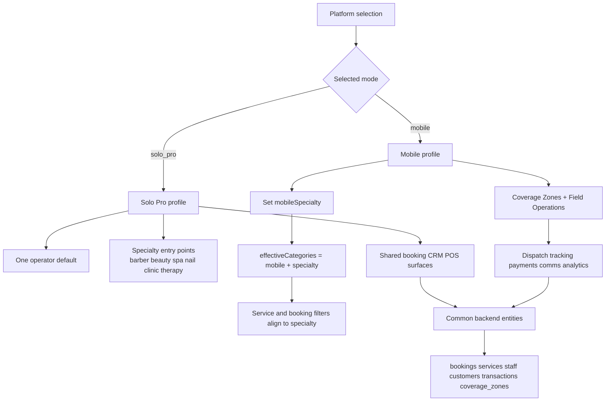

# Frontend architecture — Next.js, modes, roles, subscriptions, performance, security

**Version:** 1.0 — April 2026  
**Companion:** [00-architecture-overview.md](./00-architecture-overview.md), [02-backend-api-and-services.md](./02-backend-api-and-services.md)  

Phase 0 UI lives in **`src/`** (Vite + React Router). **Production** target is **Next.js App Router** with the same **product surface** (routes below). This document explains **how** the UI is split by **business mode**, **role view**, and **subscription feature**, and how concerns map to the backend.

---

## 1. Next.js application structure

```
apps/web/
  app/
    (marketing)/          # Landing, discover, legal — SEO + ISR
    (public)/             # /book/[orgSlug] — minimal JS, Turnstile
    (auth)/               # login, register, reset, 2FA step-up
    (portal)/             # customer-only layout
    (dashboard)/          # staff shell — mode-aware sidebar
  components/
    modes/                # optional: barber|spa|clinic… specific widgets
    shared/               # shadcn primitives
  lib/
    api-client.ts         # OpenAPI fetch wrapper
    query-keys.ts
  middleware.ts           # session refresh, request id, bot score header pass-through
```

**Rule:** **No business rules** for money, inventory quantities, or booking conflicts solely in the client — always confirmed by API responses.

---

## 2. Business modes → navigation modules

Sidebar content is selected from **mode nav config** (equivalent to `BARBER_NAV`, `BEAUTY_NAV`, `SPA_NAV`, `NAIL_BAR_NAV`, `CLINIC_NAV`, `MOBILE_NAV`, `THERAPY_NAV`, `PRODUCTS_NAV` in `AppLayout.tsx`). Each item has:

- `path`, `label`, `section`, `roles[]`, optional `requiredFeature`

### 2.1 Mode-specific labelling (terminology)

Loaded from server `business_type` + i18n files mirroring `MODE_TERMS` in `useBusinessCategory.tsx` (Barber vs Stylist vs Therapist vs Practitioner vs Mobile pro, Client vs Guest vs Patient, Appointment vs Session vs Consultation vs Home visit, Chair vs Station vs Treatment room, etc.).

`useBusinessCategory` also includes:
- `solo_pro` → Haus of Solo Pro (Professional, Client, Appointment, Workspace)
- `products` → Haus of Products (Sales/Retail terminology: Product, Customer, Order, Aisle)

### 2.2 Executive view (CEO / Director) — by mode (examples)

| Mode | Dashboard label | Notable executive-only or exec-first items |
|------|-----------------|---------------------------------------------|
| **barber** | Executive Dashboard | Commissions, payroll, audit log, QR attendance, scorecards, Haus Connect, branches |
| **beauty** | Salon Dashboard | Same pattern — stylist scorecards |
| **spa** | Wellness Dashboard | Therapist scorecards; fewer queue items on spa floor |
| **nail_bar** | Nail Bar Dashboard | Walk-in queue emphasis; nail tech scorecards |
| **clinic** | Clinic Dashboard | Patient intake, aftercare, practitioner scorecards; billing label |
| **mobile** | Mobile Dashboard | Coverage zones; dispatch dashboard; pro scorecards |
| **therapy** | Practice Dashboard | Session notes, client progress, session packages; room rental |
| **solo_pro** | Uses barber-like dashboard shell | Single-operator flow; no dedicated nav manifest yet (falls back to default mode map) |
| **products** | Store Dashboard | POS/Till, stock on hand, online orders, product catalogue, retail-first growth modules |

### 2.3 Branch manager view — by mode

| Mode | Section title | Typical items |
|------|---------------|----------------|
| barber | Branch | Today’s schedule, barber attendance, bookings, waitlist, queue, QR attendance |
| beauty | Salon Floor | Same structure, stylist wording |
| spa | Spa Floor | Session schedule, sessions, QR attendance (no waitlist in default spa nav) |
| nail_bar | Nail Floor | Queue + appointments |
| clinic | Clinic Floor | Consultations, consultation schedule, QR |
| mobile | Dispatch | Home visits, schedule, coverage zones |
| therapy | Practice | Sessions, session schedule, QR |

### 2.4 Receptionist view

| Mode | Section | Emphasis |
|------|---------|----------|
| barber | Reception | Live bookings, client check-in, queue, schedule, QR clock, POS (if plan) |
| beauty | Reception | Appointments, client check-in, schedule, QR clock, POS |
| spa | Front Desk | Sessions, guest check-in, schedule, POS |
| nail_bar | Reception | Appointments, check-in, **queue**, POS |
| clinic | Reception | Consultations, **patient** check-in, billing/POS |
| mobile | _(often omitted)_ | Mobile prototype nav — expand as product requires |
| therapy | _(minimal in prototype)_ | Add reception flows if product adds |

### 2.5 Staff “my work” view (`senior_barber` / `junior_barber` role keys)

Shared pattern: **My Dashboard**, **my bookings/sessions/visits**, **my schedule**, **my reviews**, **my earnings**, **my clients** (where present), **POS** (if plan + role). Section titles change: **My Chair** (barber), **My Station** (beauty), **My Room** (spa), **My Station** (nail), **My Practice** (clinic), **On the Road** (mobile), **My Sessions** (therapy).

### 2.6 Multi-mode (`both` or multiple categories)

Prototype falls back to **BARBER_NAV** as the richest superset when `categories.length > 1`. **Production recommendation:** build **merged nav** from a declarative manifest keyed by `{mode, role}` to avoid losing spa/clinic-only items when multi-mode.

### 2.8 Mode coverage status (implementation reality)

- `products` has a dedicated sidebar (`PRODUCTS_NAV`) in `AppLayout`.
- `solo_pro` has terminology/theming and pricing support, but no dedicated `SOLO_PRO_NAV` in `AppLayout`; single-mode fallback currently resolves to the default nav set.

### 2.9 Solo Pro and Mobile specialization model (implementation detail)

The current implementation treats these two as **cross-domain operators**, not isolated silos:

- **`solo_pro`** is a one-person operating model that can start from multiple specialties (solo barber, solo beauty, solo spa, solo nails, solo aesthetics, solo therapy in platform selection) while keeping one operator-centric UX.
- **`mobile`** is an umbrella dispatch model that overlays a specialty (`mobileSpecialty`) so the UI and data filters follow the selected domain terms/services while still enabling mobile operations.
- `useBusinessCategory` computes `effectiveCategories` for mobile as `[mobile, specialty]`; booking/services filters consume that union so mobile operators can work across the selected specialty context.
- `MOBILE_NAV` includes field-oriented modules such as **Coverage Zones** and **Field Operations** (dispatch, tracking/routes, payments, comms/safety, zones analytics).
- Coverage zones are currently radius/city based in `coverage_zones` (no direct Google Maps API integration yet); map/provider integration can be layered later for geocoding and route optimization.



### 2.7 Customer portal (unchanged by barber/spa except copy)

Routes: `/portal`, `/portal/bookings`, `/portal/loyalty`, `/portal/reviews`, `/portal/referrals`, `/portal/profile`.  
**Isolation:** Next.js `(portal)` layout; API scopes all reads to `customers.user_id`.

---

## 3. Subscription + role matrix (frontend)

Two axes gate UI:

1. **`highestRole`** (or effective role) — hides entire sections.  
2. **`requiredFeature` + plan`** — hides or locks items (mirror prototype `FEATURE_PLAN_MAP` in `AppLayout`).

**Implementation:** server returns `features: string[]` on `GET /me`; client uses `useMemo` to filter nav; **server** repeats checks on each mutation route.

**Optional:** management bypass for nav only — same as prototype `FeatureGate` discussion; document as product risk.

---

## 4. Caching (browser and CDN)

| Layer | What | Policy |
|-------|------|--------|
| **TanStack Query** | Server state | Keys: `['org', orgId, entity, params]`; stale times per [00](./00-architecture-overview.md) companion master plan |
| **Next fetch cache** | RSC `fetch` to Laravel | `next: { revalidate: N }` for semi-static org branding on public book |
| **CDN** | Static chunks, images | Immutable `/_next/static` |
| **SWR in browser** | Avoid duplicate inflight | React Query `staleTime` + `placeholderData` |

**Invalidation:** on mutation success, `queryClient.invalidateQueries({ queryKey: ['org', orgId, 'bookings'] })`; on Soketi event, targeted `setQueryData` for queue boards.

---

## 5. Image optimization

- Use **`next/image`** with remote patterns for S3/R2 hostnames.  
- Store **original + thumbnail** keys in DB for gallery; list views request thumb URL only.  
- **Upload flow:** Next requests signed URL from Laravel → direct PUT to S3 → confirm API to attach metadata.

---

## 6. SEO

| Surface | Pattern |
|---------|---------|
| Marketing pages | RSC + metadata API (`generateMetadata`) |
| Discover / public profiles | ISR or SSG with revalidate; JSON-LD for LocalBusiness where applicable |
| Authenticated dashboard | `noindex` via layout metadata |
| Public booking embed | Lightweight page; canonical URL per org slug |

---

## 7. Lazy loading and code splitting

- **Route-level:** `next/dynamic` for heavy dashboards (charts, map for coverage zones).  
- **Role-level:** optional separate chunks for `executive` vs `reception` if bundle size demands (split by layout child).  
- **Maps / QR:** load `html5-qrcode` or map lib only inside client components when route active.

---

## 8. Frontend security

| Topic | Mitigation |
|-------|------------|
| XSS | React default escaping; sanitize any `dangerouslySetInnerHTML` (marketing only) |
| CSRF | Same-site cookies + Laravel Sanctum CSRF cookie for SPA |
| Token storage | Prefer **httpOnly** session; if JWT in memory, no `localStorage` for access token |
| Clickjacking | `X-Frame-Options` / CSP `frame-ancestors` on staff app |
| Secrets | Never embed Daraja or Twilio keys in Next.js bundle |
| Content Security Policy | Strict script-src; allow Soketi wss host |
| Dependency supply chain | lockfile + CI audit |

---

## 9. Mapping Phase 0 pages → Next route groups

| Phase 0 path | Suggested Next segment |
|--------------|-------------------------|
| `/` | `(marketing)/page.tsx` |
| `/book` | `(public)/book/page.tsx` or `/book/[orgSlug]` |
| `/auth` | `(auth)/login` |
| `/portal/*` | `(portal)/...` |
| `/dashboard` … all staff routes | `(dashboard)/...` mirror same paths for fewer user bookmarks broken |

---

© 2026 Haus of Grooming OS. All rights reserved.
