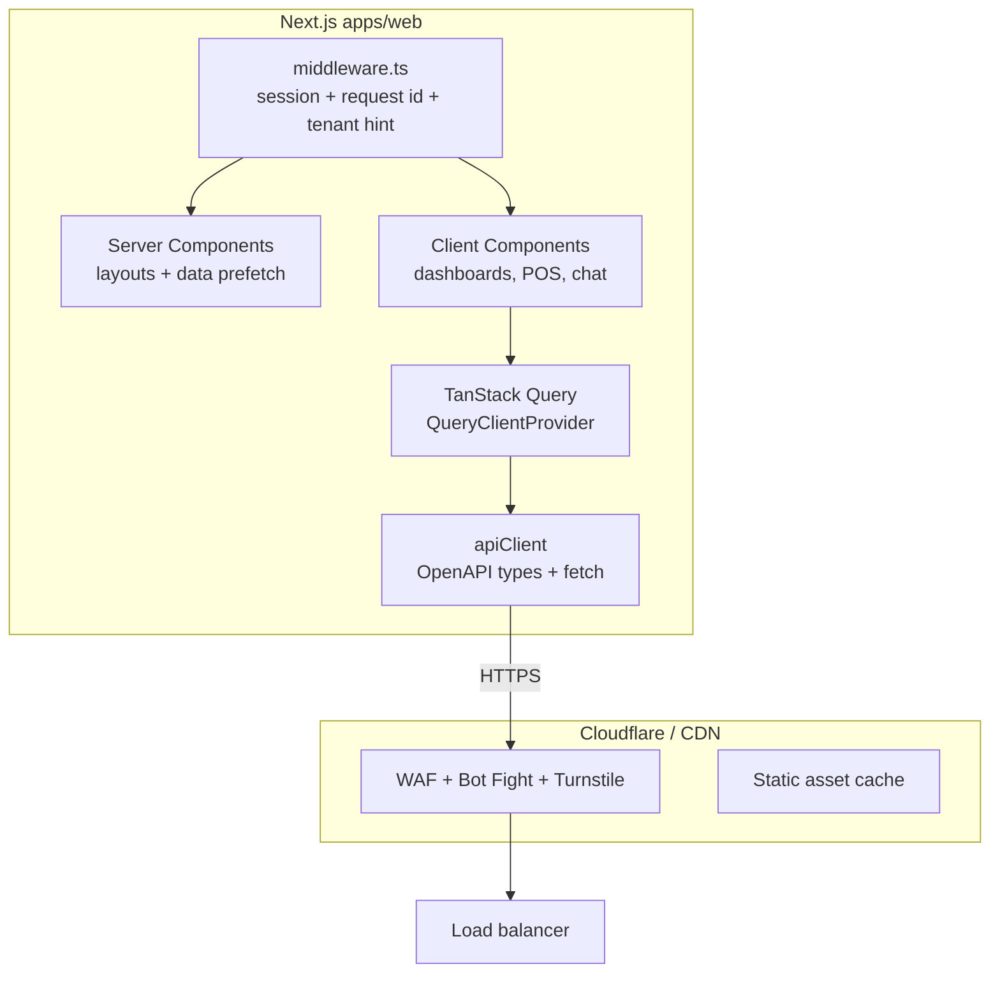
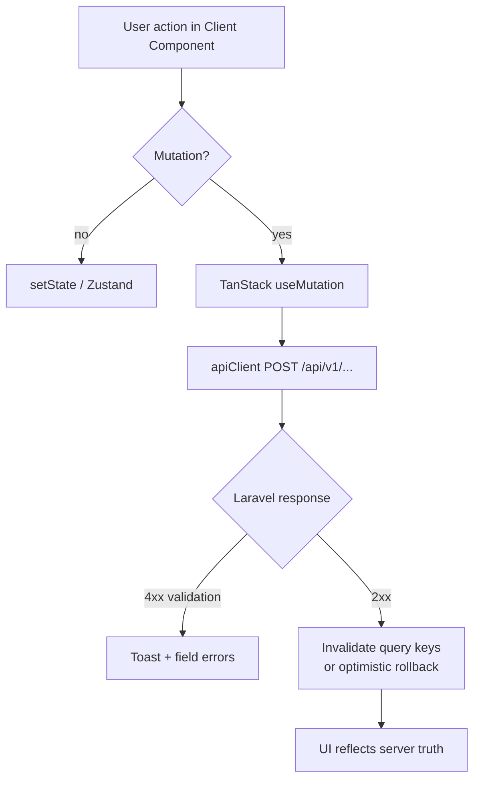
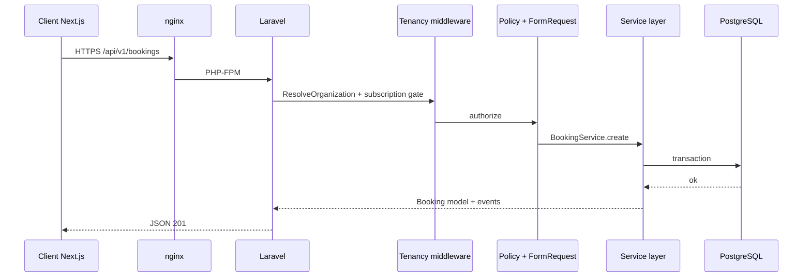
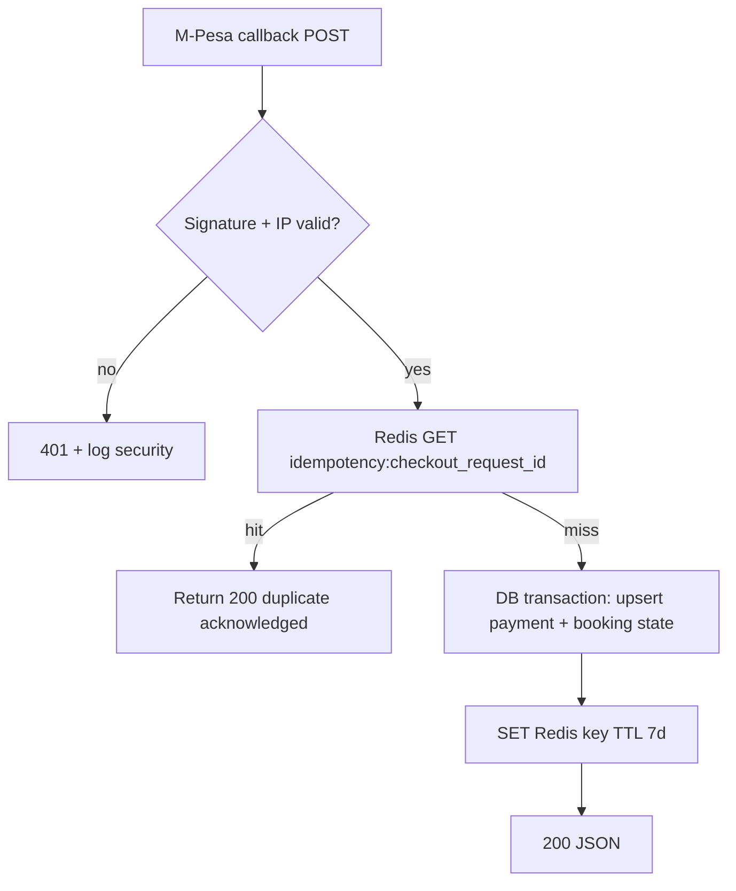
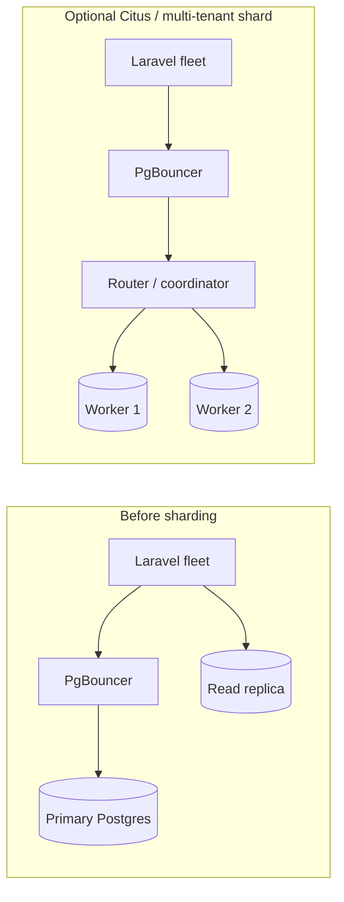
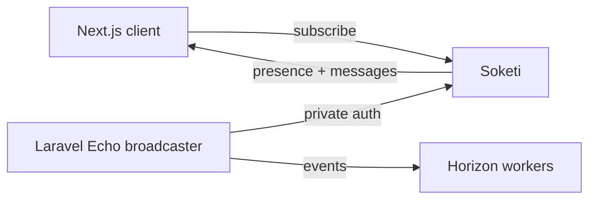

# Haus of Grooming OS — Full-Stack Implementation Master Plan

**Classification:** Confidential — Engineering  
**Version:** 1.1 — April 2026  
**Audience:** Staff engineers, architects, DevOps, security reviewers  

**Split documentation (read first):** [docs/README.md](./README.md) — [00 overview](./00-architecture-overview.md), [01 data & storage](./01-data-storage-and-schema.md), [02 backend & APIs](./02-backend-api-and-services.md), [03 frontend](./03-frontend-modules-and-ux.md), [04 nav matrix](./04-navigation-matrix-by-mode-and-role.md).

---

## Document purpose

This document is the **authoritative implementation and operations plan** for building **Haus of Grooming OS** on the **production target stack** (Next.js, Laravel modular monolith, PostgreSQL, Redis, Soketi, object storage, dedicated workers). It explicitly **does not** prescribe Lovable, Supabase client SDKs, Vite SPA-only hosting, or `@lovable.dev/*` as runtime dependencies for production.

The **`barber-house-charm` repository** is treated as **Phase 0 — Product & data model reference**: UI flows, route map, subscription feature matrix, multi-mode terminology, and PostgreSQL-oriented entity shapes. Those artifacts inform OpenAPI schemas, Laravel modules, and Next.js routes; they are **not** the final deployment architecture.

For screen-level product detail, continue to use [haus-of-grooming-system-blueprint.md](./haus-of-grooming-system-blueprint.md). For a snapshot of the **legacy prototype stack** (historical), see [technical-architecture-current-implementation.md](./technical-architecture-current-implementation.md).

---

## Table of contents

1. [Target technology stack](#1-target-technology-stack)  
2. [Program roadmap (phased delivery)](#2-program-roadmap-phased-delivery)  
3. [Repository and monorepo strategy](#3-repository-and-monorepo-strategy)  
4. [Next.js frontend — architecture & design](#4-nextjs-frontend--architecture--design)  
5. [State management, caching on the client, and data flow](#5-state-management-caching-on-the-client-and-data-flow)  
6. [Laravel backend — modular monolith architecture](#6-laravel-backend--modular-monolith-architecture)  
7. [API surface, versioning, and idempotency](#7-api-surface-versioning-and-idempotency)  
8. [PostgreSQL — schema, tenancy, scaling, and sharding](#8-postgresql--schema-tenancy-scaling-and-sharding)  
9. [Redis — sessions, cache, queues, rate limiting](#9-redis--sessions-cache-queues-rate-limiting)  
10. [Realtime, messaging, and extracted services](#10-realtime-messaging-and-extracted-services)  
11. [Load handling, capacity planning, and choke points](#11-load-handling-capacity-planning-and-choke-points)  
12. [Bot protection, abuse prevention, and WAF](#12-bot-protection-abuse-prevention-and-waf)  
13. [Security architecture (senior baseline)](#13-security-architecture-senior-baseline)  
14. [DevOps — CI/CD, environments, secrets, and releases](#14-devops--cicd-environments-secrets-and-releases)  
15. [Observability, SLOs, and incident response](#15-observability-slos-and-incident-response)  
16. [Definition of done (engineering)](#16-definition-of-done-engineering)  

---

## 1. Target technology stack

| Layer | Technology | Role |
|-------|------------|------|
| **Web app (staff, admin, customer portal, marketing)** | **Next.js 14+** (App Router), **TypeScript**, **Tailwind CSS**, **shadcn/ui** (or equivalent Radix-based kit) | SSR/SSG for public SEO, RSC where beneficial, client islands for dashboards |
| **Server state** | **TanStack Query v5** + thin **API client** (OpenAPI-generated or hand-typed fetch) | Normalized server cache, mutations, optimistic updates |
| **Client/UI state** | **Zustand** or lightweight **React context** for ephemeral UI (drawers, wizard step) | Avoid putting server truth in global client stores |
| **Auth (browser ↔ API)** | **Laravel Sanctum** (SPA cookie mode for same-site subdomains) **or** short-lived **access + refresh** JWT for mobile/PWA | CSRF for cookie mode; rotation on sensitive ops |
| **Primary API** | **Laravel 11**, **PHP 8.3**, **modular packages** (internal `modules/*` or `nwidart/laravel-modules`) | Domain boundaries, events, jobs |
| **AuthZ** | **Spatie Laravel Permission** | RBAC aligned with blueprint roles |
| **Primary database** | **PostgreSQL 16** | ACID, reporting, tenancy column + indexes |
| **Connection pooling** | **PgBouncer** (transaction mode) in front of Postgres | Avoid connection storms from PHP-FPM |
| **Cache & queue backend** | **Redis 7** | Cache, session store, Horizon queues, rate-limit counters, distributed locks |
| **Queue workers** | **Laravel Horizon** | SMS, WhatsApp, email, M-Pesa reconciliation, reports |
| **Scheduler** | Laravel `schedule:` in dedicated **scheduler** container / systemd timer | Reminders, subscription dunning |
| **Realtime** | **Soketi** (Pusher protocol) or managed **Pusher/Ably** | Staff chat, live queue, booking notifications |
| **Object storage** | **S3-compatible** (AWS S3, Cloudflare R2, MinIO dev) | Gallery, consent PDFs, receipts, exports |
| **Calling** | **Node.js 20** service (WebRTC signaling, provider webhooks) | Isolated scaling; talks to Laravel over signed webhooks |
| **Edge / CDN** | **Cloudflare** (recommended) or equivalent | TLS, WAF, bot management, static asset cache, Turnstile |
| **Containers** | **Docker** + **Compose** (MVP) → **Kubernetes** or **ECS** at scale | Same images across envs |
| **CI/CD** | **GitHub Actions** (or GitLab CI) | Lint, test, SAST, build, sign, deploy |

**Explicitly retired for production:** Lovable Cloud Auth, Supabase JS client as primary API, Vite SPA as sole app shell, demo-only AI gateways tied to Lovable, PostgREST as application server.

---

## 2. Program roadmap (phased delivery)

### Phase 0 — Lock reference model (current repo)

- Freeze **route map**, **feature keys**, **role names**, and **entity list** from blueprint + `src/integrations/supabase/types.ts` as **domain checklist**.  
- Lock supported business categories from implementation: `barber`, `beauty`, `spa`, `nail_bar`, `clinic`, `mobile`, `therapy`, `solo_pro`, `products` (with `both` for multi-mode subscription behavior).  
- Capture mode-specific rollout constraints in planning docs: `solo_pro` (single-operator defaults, minimal branch/HR complexity) and `products` (retail-first POS + inventory + order workflows).  
- Export **OpenAPI draft** from that checklist (can be manual YAML first).  
- Accept that prototype RLS/Edge code is **not** carried forward line-for-line.

### Phase 1 — Platform skeleton

- Monorepo bootstrap (`apps/web`, `apps/api` or `services/api`).  
- Laravel: auth, organizations, members, subscriptions (trial), Sanctum, Horizon + Redis, base middleware `ResolveOrganization`.  
- Next.js: marketing shell, auth pages, protected layout stubs calling **real** Laravel health + `GET /api/v1/me`.  
- Postgres: core tenancy tables + migrations from Phase 0 model.  
- CI: PHPStan/Pint, ESLint, typecheck, unit tests on PR.

### Phase 2 — Vertical slice: bookings + notifications

- Booking create/read/update, availability service, conflict rules.  
- Queue jobs: confirmation SMS/WhatsApp (provider abstraction).  
- Next.js: staff booking board + public booking widget (SSR for embed).  
- Soketi: booking-created fanout to org channel.

### Phase 3 — POS, M-Pesa, transactions

- STK Push initiation, idempotent callback handler, reconciliation reports.  
- Rate limits + IP allowlist for callbacks (Safaricom ranges + signature verification).  
- Redis idempotency keys for `ResultCode` replays.

### Phase 4 — CRM, inventory, HR surfaces

- Clients, loyalty, inventory, commissions, payroll exports.  
- Heavy read paths: materialized views or read-model tables refreshed by jobs.

### Phase 5 — Enterprise features

- Multi-branch, audit log, advanced analytics, API keys for enterprise tenants.  
- Read replica routing for reporting queries (Laravel connection `pgsql_report`).

### Phase 6 — Hardening & scale

- Load tests (k6), chaos drills, backup/restore runbooks, penetration test remediation.  
- Optional **Citus** or **tenant shard** evaluation only if measured DB CPU / row churn demands it.

---

## 3. Repository and monorepo strategy

**Recommended layout:**

```text
/
  apps/
    web/                 # Next.js
    api/                 # Laravel (or packages/api if preferred)
  packages/
    ui/                  # Shared design tokens, primitives (optional)
    contracts/           # OpenAPI bundle, JSON Schema, TS types generated
  infra/
    docker/              # Compose overlays, nginx, Dockerfile.* 
    terraform/           # or Pulumi — VPC, RDS, ElastiCache, S3, secrets
  .github/workflows/
```

**Versioning:** API **v1** path prefix `/api/v1` frozen after first production customer; breaking changes ship as **v2** with overlap period.

**Contracts-first:** OpenAPI in `packages/contracts`; generate **TypeScript** client for Next.js and optionally **PHP** DTO validation (or manual FormRequests mirroring spec).

---

## 4. Next.js frontend — architecture & design

### 4.1 Routing and layouts (mapping from Phase 0)

| Concern | Next.js pattern |
|--------|------------------|
| Marketing, SEO | `app/(marketing)/**` — RSC + static/ISR where possible |
| Auth | `app/(auth)/login`, `signup`, `reset-password` |
| Staff dashboard | `app/(dashboard)/layout.tsx` — server-verified session, client-heavy children |
| Customer portal | `app/(portal)/layout.tsx` |
| Public booking embed | `app/(public)/book/[orgSlug]/page.tsx` — minimal JS, Turnstile |

**Middleware (`middleware.ts`):**

- Refresh / validate session cookie (if Sanctum SPA).  
- Attach **request id** header for tracing.  
- Optional: resolve **tenant host** (`{slug}.hausofgrooming.com`) and pass `x-tenant-slug` to server components (never trust without API verification).

### 4.2 Server vs client boundaries

- **Default to Server Components** for read-mostly pages that aggregate multiple API calls (waterfall avoidance: parallel `fetch` on server).  
- **Client Components** for: calendars, drag-drop schedule, POS keypad, WebSocket subscribers, complex forms with instant validation.  
- **Server Actions** (optional): only for mutations that do not duplicate business rules already in Laravel unless the Action is a **BFF** that only proxies to Laravel with Zod validation (avoid two sources of truth).

**Preferred pattern for a modular monolith:** Next.js **does not** embed business rules for money, inventory, or booking conflicts; it **orchestrates UX** and calls Laravel.

### 4.3 Internationalization and theming

- Keep `next-intl` or equivalent; mode-specific copy can live in JSON per `business_mode`.  
- Theme: CSS variables + Tailwind; **branding** fetched server-side per org for widget routes.

### 4.4 High-level frontend module diagram



---

## 5. State management, caching on the client, and data flow

### 5.1 Principles

1. **Server state** lives in **TanStack Query** — keyed by `['org', orgId, 'bookings', filters]`.  
2. **URL state** owns filters (date range, branch) via `nuqs` or Next `searchParams` — shareable links, back button correct.  
3. **UI state** (modal open, step index) stays in **local useState** or **Zustand** stores namespaced per feature.  
4. **No duplicated source of truth** for subscription entitlements: server returns `features: string[]` or bitmask; client gates UX; **Laravel** gates mutations.

### 5.2 State + mutation flow (Mermaid)



### 5.3 Client-side caching policy

| Data type | Stale time | Notes |
|-----------|------------|--------|
| `GET /me`, org, subscription | Short (30–60s) | After plan change, force refetch |
| Reference data (services, staff list) | Medium (5–15m) | Invalidate on admin CRUD mutations |
| Booking board for “today” | Low (30s) + WebSocket patch | Soketi pushes invalidate or patch cache |
| Static mode dictionary | Long (24h) | Versioned by `BUILD_ID` |

Use **`placeholderData`** / **`keepPreviousData`** for pagination to avoid flicker.

---

## 6. Laravel backend — modular monolith architecture

### 6.1 Module boundaries (example)

Align packages with blueprint domains:

| Module | Responsibilities | Publishes / listens |
|--------|----------------|---------------------|
| `Auth` | Register, login, password, Sanctum tokens | `UserRegistered` |
| `Tenancy` | Organization, members, branches, context | `OrganizationCreated` |
| `Billing` | Plans, trials, Cashier/M-Pesa subscription | webhooks |
| `Booking` | Availability, lifecycle, no-shows | `BookingConfirmed`, `BookingCancelled` |
| `Pos` | Transactions, line items, tenders | `PaymentCaptured` |
| `Crm` | Customers, loyalty, referrals | — |
| `Staff` | Profiles, schedules, commissions, attendance | `QrScanRecorded` |
| `Inventory` | SKUs, consumption, suppliers | — |
| `Notifications` | Templates, provider dispatch | queue jobs |
| `Reporting` | Aggregates, exports | scheduled jobs |
| `Integrations` | M-Pesa, Twilio, WhatsApp, email | inbound controllers |

**Rules:** modules **do not** reach across Eloquent models directly for writes; use **application services** + **domain events**. Cross-module reads use **query services** or read APIs.

### 6.2 Request lifecycle



### 6.3 Tenancy enforcement (application layer)

1. **Middleware** `EnsureOrganizationContext`: resolves `organization_id` from authenticated user membership — **never** from raw request body for privileged routes.  
2. **Global Eloquent scope** `OrganizationScope` on tenant models.  
3. **Policies** accept `Organization $organization` resolved from route or session.  
4. **Public booking** routes use **signed org token** or **slug + rate limit + Turnstile** then scope all queries to that org only.

### 6.4 Background processing

- **Horizon** queues: `notifications`, `integrations`, `reports`, `default` — separate concurrency per queue.  
- **Failed jobs** → alerting + DLQ inspection playbook.  
- **Idempotent jobs:** use `ShouldBeUnique` + Redis lock for payment reconciliation.

---

## 7. API surface, versioning, and idempotency

### 7.1 Conventions

- **REST** resource style: `/api/v1/organizations/{org}/bookings`, nested where natural.  
- **Pagination:** cursor-based for high churn (`bookings`, `notifications`); offset acceptable for admin lists <10k rows with filters.  
- **Filtering:** `filter[status]=scheduled&filter[branch_id]=`.  
- **Sparse fieldsets:** `fields[bookings]=id,start_time,status` for mobile.  
- **Errors:** RFC 7807 `application/problem+json` (single format company-wide).

### 7.2 Representative resource groups (from Phase 0 route map)

Group endpoints mirror blueprint modules (non-exhaustive; maintain OpenAPI as source of truth):

- **Auth:** `POST /auth/register`, `POST /auth/login`, `POST /auth/logout`, `POST /auth/forgot-password`  
- **Me:** `GET /me` (user, roles, orgs, active_org, subscription, `features[]`)  
- **Organizations / branches:** CRUD under enterprise gate  
- **Bookings:** CRUD, `POST .../check-availability`, `POST .../transition` (state machine)  
- **POS:** `POST .../transactions`, `POST .../mpesa/stk`, `POST /webhooks/mpesa` (mTLS or IP + signature)  
- **CRM:** customers, loyalty, referrals  
- **Staff:** schedules, QR scans, payroll exports  
- **Inventory:** items, movements, suppliers  
- **Media:** `POST /uploads/signed-url` → direct S3 upload → `POST /media/confirm`  
- **Realtime token:** `POST /realtime/token` → Soketi private channel auth  

### 7.3 Idempotency (payments and webhooks)



---

## 8. PostgreSQL — schema, tenancy, scaling, and sharding

### 8.1 Tenancy model

- **Shared database, shared schema**, `organization_id uuid NOT NULL` on all tenant tables (matches Phase 0 types).  
- **Composite indexes** leading with `organization_id` for every hot query pattern.  
- **Partial indexes** for common filters (`WHERE status = 'scheduled' AND booking_date = CURRENT_DATE`).

### 8.2 Migrations and zero-downtime deploys

- Expand-contract pattern: add column → dual-write → backfill job → switch reads → drop old.  
- Long-running backfills via Horizon, not in web request.

### 8.3 Read scaling

- **Primary** for writes; **read replica** for heavy reporting (`pgsql_report` connection, **sticky session not required** if queries are read-only).  
- **Materialized views** refreshed nightly or on event for executive dashboards.

### 8.4 Partitioning (before “sharding”)

- **Range partition** large append-only tables (`audit_log`, `notification_logs`) by `created_at` month.  
- Keeps indexes smaller and vacuum predictable.

### 8.5 Sharding (only when metrics demand)

**Reality check:** sharding PostgreSQL by tenant is a **last resort** after: PgBouncer, better indexes, partitioning, read replicas, and queue offload.

If required:

- **Citus** (extension) with `organization_id` as distribution key for selected hypertables **or**  
- **Schema-per-tenant** for a handful of whale tenants (operational complexity high).

Document **exit criteria** (example): sustained >70% CPU on largest instance, replication lag >2s, or single-table row count >100M with unavoidable sequential scans.



---

## 9. Redis — sessions, cache, queues, rate limiting

### 9.1 Key namespaces

Pattern: `{env}:{org_id}:{feature}:{id}` — e.g. `prod:uuid:cache:services:v3`.

### 9.2 Usage matrix

| Use | Implementation | TTL / eviction |
|-----|----------------|----------------|
| Session / token blocklist | Redis session driver or JWT denylist | session lifetime |
| HTTP response cache | Laravel `Cache::tags` when using taggable store | per route (60–300s) |
| Rate limiting | `RateLimiter::for` backed by Redis | 1–15 min windows |
| Idempotency | `SETNX` + payload hash | 24h–7d |
| Distributed lock | `Redlock` pattern for cron overlap | seconds |
| Queue | Horizon | until processed |

### 9.3 Cache stampede mitigation

- **Probabilistic early expiration** (“jitter”) on hot keys.  
- **Mutex** around expensive recompute for dashboard tiles.  
- **Warming** jobs after deploy for top org dashboards (optional).

---

## 10. Realtime, messaging, and extracted services

| Concern | Choice |
|---------|--------|
| Staff chat, live queue | **Soketi** behind internal LB; Laravel **broadcasting** auth route issues signed channel names per `org.{id}` |
| Cross-region | Prefer managed WebSocket vendor if latency unacceptable |
| Calling | **Node** service; Laravel records **call_logs** via signed webhook |
| Email/SMS/WhatsApp | **Queue jobs** only — never inline in HTTP request beyond enqueue |



---

## 11. Load handling, capacity planning, and choke points

### 11.1 Horizontal scale path

1. **Stateless** Laravel containers behind ALB/nginx — no local disk session.  
2. **PHP-FPM** tuning: `pm.max_children` from RAM / average worker RSS; avoid oversized pools that crush Postgres.  
3. **PgBouncer** transaction pooling — **disable** prepared statements that break in transaction mode or use PgBouncer 1.21+ features correctly.  
4. **Separate worker fleet** for Horizon from web pods at high load.  
5. **S3** for all uploads — not PHP disk.

### 11.2 Choke points to design against

| Choke point | Mitigation |
|-------------|------------|
| DB connection exhaustion | PgBouncer, right-size pool, separate `reporting` connection limit |
| Thundering herd on cron | Jitter schedules, shard cron by `organization_id % N` |
| Webhook retries | Idempotency store, safe replays |
| Large CSV exports | Async job + S3 presigned download link |
| N+1 queries | eager loads, `strict_model` prevention, API fieldsets |
| Retail campaign spikes (`products`) | Pre-warm catalog caches, separate queue workers for order webhooks, enforce checkout idempotency keys |

### 11.3 Autoscaling signals

- **CPU + request queue** for web; **queue depth + job latency** for workers; **replication lag** for adding replicas not primaries.

---

## 12. Bot protection, abuse prevention, and WAF

### 12.1 Edge (Cloudflare or equivalent)

- **WAF** managed ruleset (OWASP CRS), geo block if not serving region, **bot score** threshold on `/book`, `/auth`, `/webhooks/*` (careful — webhooks need allowlist not CAPTCHA).  
- **Turnstile** (or reCAPTCHA v3) on **public booking** and **signup**.  
- **Challenge** page only when score suspicious.

### 12.2 Application layer

- **Laravel rate limiters** per IP + per user + per org for expensive endpoints (`mpesa/stk`, `auth/login`).  
- **Exponential backoff** headers on repeated failures.  
- **Honeypot fields** on public forms (silent discard).  
- **Signed embed tokens** for booking widget: `org_id`, `exp`, `nonce` in JWT verified by Laravel.

### 12.3 Webhook hardening

- **M-Pesa:** IP allowlist + HMAC + idempotency + replay window (clock skew tolerance).  
- **Twilio:** signature validation on inbound.  
- **Never** expose Horizon dashboard or Soketi admin without VPN / SSO.

---

## 13. Security architecture (senior baseline)

- **Transport:** TLS 1.2+ everywhere; HSTS; **mTLS** optional between internal services.  
- **Secrets:** AWS Secrets Manager / Doppler / Vault — **never** in git; rotation quarterly.  
- **Least privilege DB users:** migrate user separate from app user if using migrations from CI.  
- **SAST/DAST** in CI (PHPStan level 8, Larastan, Semgrep, OWASP ZAP on schedule).  
- **Dependency updates:** Renovate + weekly merge window.  
- **Audit log:** append-only table + optional stream to SIEM.  
- **PII:** encrypt at rest (disk), minimize in logs, **mask** phone in non-security logs.

---

## 14. DevOps — CI/CD, environments, secrets, and releases

### 14.1 Environments

| Env | Purpose | Data |
|-----|---------|------|
| `local` | Docker Compose | seed + anonymized snapshot optional |
| `ci` | Ephemeral DB for tests | migrations only |
| `staging` | Full integration, provider sandboxes | masked copy of prod quarterly |
| `production` | Live | backups + PITR |

### 14.2 GitHub Actions pipeline (example)

```mermaid
flowchart LR
  PR[Pull request] --> LINT[Lint TS + PHP\nESLint + Pint]
  LINT --> TEST[Unit + integration\nPest + Vitest]
  TEST --> SAST[PHPStan + Semgrep]
  SAST --> BUILD[Build Docker images]
  BUILD --> SCAN[Trivy scan]
  SCAN --> PUSH[Push to registry]
  PUSH --> DEPLOY_STG[Deploy staging]
  DEPLOY_STG --> E2E[Playwright smoke]
  E2E --> MANUAL[Change approval]
  MANUAL --> DEPLOY_PROD[Rolling deploy prod]
```



### 14.3 Database migrations in CI/CD

- **Automated** `php artisan migrate --force` in deploy step **after** new code is live **only if** backward compatible; otherwise use **expand/contract** with feature flags.  
- Maintain **rollback** playbook (revert deployment + forward-fix migration).

### 14.4 Release strategy

- **Rolling updates** on ECS/K8s with health checks (`/health` hits DB + Redis).  
- **Feature flags** (LaunchDarkly or Unleash self-hosted) for risky modules.  
- **Blue/green** optional when zero-downtime DB cutover needed.

---

## 15. Observability, SLOs, and incident response

### 15.1 Minimum viable observability

- **OpenTelemetry** traces: Next.js server + Laravel (`otel-php`) + nginx span propagation.  
- **Metrics:** Prometheus + Grafana (request rate, latency p95/p99, queue depth, DB connections, Redis memory).  
- **Logs:** structured JSON to Loki / CloudWatch; **correlation id** from Next middleware through Laravel `X-Request-Id`.  
- **Uptime:** synthetic checks on `/health`, public booking POST (dry-run in staging).

### 15.2 Example SLOs

| Surface | SLO | Error budget action |
|---------|-----|---------------------|
| API availability | 99.9% monthly | freeze features, scale workers |
| Booking create p95 | <400ms excluding POS | profile SQL + indexes |
| Webhook processing | 99.95% success | alert + runbook for provider outage |

### 15.3 Incident severity

- **SEV1** payment outage — page on-call, communicate in status page.  
- **SEV2** partial feature — degrade gracefully (disable non-critical queues).

---

## 16. Definition of done (engineering)

For each vertical slice merging to `main`:

1. OpenAPI updated + TS client regenerated.  
2. Laravel FormRequests + Policies + feature tests.  
3. Next.js: RSC data fetch or TanStack hooks with loading/error states; a11y pass on primary path.  
4. Horizon job idempotency documented for any payment or webhook path.  
5. Runbook entry for new env vars and failure modes.  
6. Load test ticket filed if endpoint is hot path (`/book`, `/mpesa/callback`).

---

## Appendix A — Mapping Phase 0 tables to Laravel modules

Use `src/integrations/supabase/types.ts` as a **checklist** for Eloquent models and migrations (`bookings`, `booking_services`, `transactions`, `subscriptions`, …). Rename or normalize only where Laravel naming conventions (`snake_case` table, `StudlyCase` model) require it.

---

## Appendix B — Removal checklist (prototype stack)

When decommissioning the prototype:

- Remove `@lovable.dev/*`, Supabase client as **production** dependency; archive repo or keep as **design reference** only.  
- Replace any **demo fallback** product behavior with explicit “empty state” UX in Next.js.  
- Move AI features to **first-party** OpenAI/Gemini keys with budget alerts.

---

**Document owner:** Engineering  
**Next review:** After Phase 1 cutover to Laravel + Next.js production path  

© 2026 Haus of Grooming OS. All rights reserved.
