# Haus of Grooming OS — Technical Architecture (Prototype Repository Snapshot)

**Classification:** Confidential — Engineering & Technical Due Diligence  
**Version:** 1.1 — April 2026  

> **Production target:** Use the split doc set **[README.md](./README.md)** (overview **00**, data **01**, backend **02**, frontend **03**, nav matrix **04**) and **[full-stack-implementation-master-plan.md](./full-stack-implementation-master-plan.md)** for CI/CD and phases. The blueprint **Tech Stack** in [haus-of-grooming-system-blueprint.md](./haus-of-grooming-system-blueprint.md) matches that target. **This file** remains a factual snapshot of the **prototype** (Vite + Supabase) for historical comparison only.

**Scope:** This document describes the **code and data paths that exist in the `barber-house-charm` repository today** as a **UI and data-model reference implementation**, not the final production stack. The **implemented stack** here is a **single-page application** on **Supabase** (PostgreSQL + Auth + Row Level Security + Edge Functions), not the Laravel / Next.js / Soketi architecture used for the shipped product.

---

## 1. Executive summary

The repository ships a **multi-tenant grooming / beauty operations dashboard** and **customer portal** as a **Vite + React 18 + TypeScript** client. **Supabase** provides authentication, PostgreSQL persistence, storage buckets, optional realtime, and **Deno Edge Functions** for scheduled-style workloads (for example SMS reminders via Twilio through Lovable’s connector gateway).

**Primary user journeys covered in code:** staff and executive dashboards (bookings, POS, inventory, loyalty, HR-style surfaces), customer portal routes, public booking and discovery pages, plan selection and trial state, QR attendance visualization, and feature gating by subscription tier.

**Architectural posture:** there is **no application server** in this repo. Business rules are split between **the browser** (React components, TanStack Query mutations) and **PostgreSQL** (RLS policies, triggers, RPCs such as `is_management`, `get_user_organization_id`). Any gap between RLS and client-supplied `organization_id` on inserts is a **security and data-integrity review point**, not an abstract risk.

---

## 2. Implemented system architecture

### 2.1 Layered view (what actually runs)

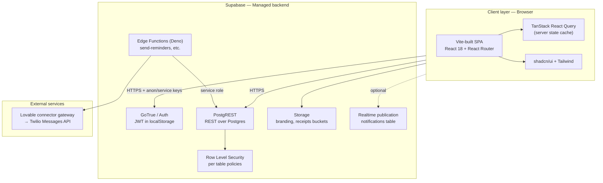

### 2.2 Technology inventory

| Layer | Technology | Role in this repo |
|-------|------------|-------------------|
| UI | React 18, Tailwind, Radix/shadcn | Pages, layouts, forms |
| Routing | `react-router-dom` v6 | Public vs protected routes, customer vs staff shells |
| State | TanStack Query v5 | Subscription, roles, org id, entity lists |
| Auth | `@supabase/supabase-js` | `signUp` / `signInWithPassword`, session persistence |
| Data access | `db.from(table)` wrapper in `src/lib/db.ts` | Thin alias over Supabase client (typed schema in `types.ts`) |
| Optional OAuth | `@lovable.dev/cloud-auth-js` | Lovable cloud auth bridge |
| DB | PostgreSQL (via Supabase) | Tenancy, bookings, CRM, inventory, etc. |
| Async / integrations | Supabase Edge Functions | Reminder job calling Twilio |

---

## 3. Application composition and routing

### 3.1 Provider tree

Order in `App.tsx` matters for context availability:

1. `QueryClientProvider` — global query cache  
2. `TooltipProvider`, `I18nProvider`, `ErrorBoundary`  
3. `BrowserRouter`  
4. `AuthProvider` — subscribes to `supabase.auth.onAuthStateChange`  
5. `BusinessCategoryProvider` — mode labels and themes (`barber`, `beauty`, `spa`, `nail_bar`, `clinic`, `mobile`, `therapy`, `solo_pro`, `products`)  
6. `SubscriptionCategorySync` — one-time sync of `subscriptions.business_type` into category context after subscription query resolves  

### 3.2 Route protection matrix

| Wrapper | Behavior |
|---------|----------|
| `ProtectedRoute` | If `loading` → spinner; if no `user` → redirect `/auth`; else render children |
| `PublicRoute` | If `loading` or (`user` and roles still loading) → spinner; if `user` → redirect to `/portal` if highest role is `customer`, else `/dashboard`; else render children |
| `P` | `ProtectedRoute` + `AppLayout` (staff shell) |
| `PG` | Same as `P` + `RouteFeatureGate` for a specific `Feature` |
| `CP` | `ProtectedRoute` + `CustomerLayout` |
| `SmartRedirect` (`/home`) | Authenticated users: customers → `/portal`, everyone else → `/dashboard` |

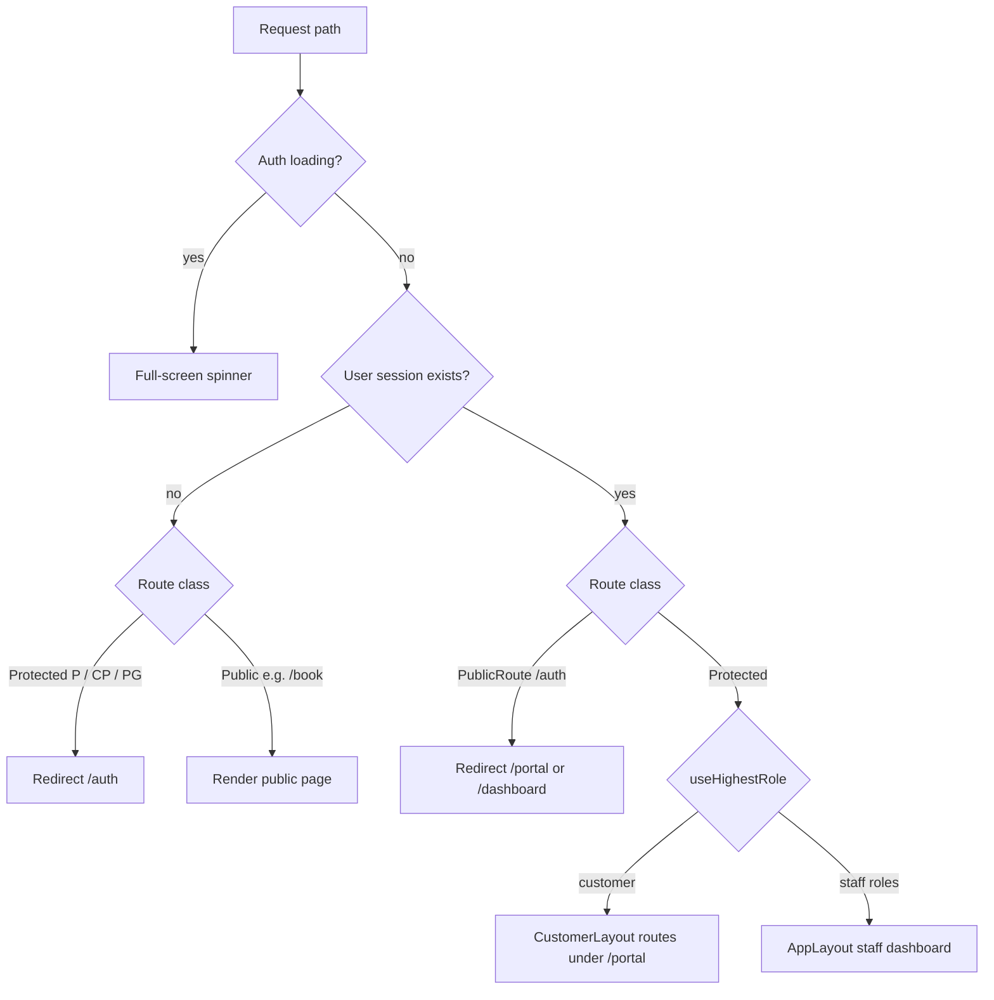

---

## 4. Authentication and identity data flow

### 4.1 Sign-in / sign-up (client)

`AuthPage` branches on `isLogin` (from URL `mode`):

- **Login:** `signIn(email, password)` → on success toast + `navigate(meta.loginRedirect)`  
- **Signup:** validates non-empty `fullName` → `signUp` with `user_metadata.full_name` → email confirmation message  

`useAuth` listens to Supabase auth state and exposes `user`, `session`, `loading`.

### 4.2 Post-signup server-side provisioning (database trigger)

Migration `20260331000000_subscriptions.sql` defines `handle_new_user()` (on auth user insert) which:

1. Inserts `profiles`  
2. Inserts `user_roles` with role `customer`  
3. Inserts `customers` row linked to `user_id`  
4. Creates `organizations` (owner = new user)  
5. Adds `organization_members`  
6. Inserts `subscriptions` with **starter** plan, **trial**, trial end +7 days  

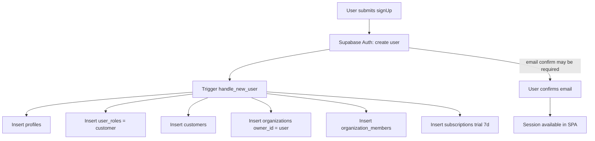

**Implication:** every new account starts as **customer** with an **owned organization** and trial subscription. Elevating to staff roles is a **separate data path** (updates to `user_roles` / onboarding flows), not shown in the trigger file in this repo.

---

## 5. Multi-tenancy and organization context

### 5.1 Resolving `organization_id`

- `useOrganizationId` queries `organization_members` for `user_id = auth.uid()`, **`.single()`**, caches 30 minutes.  
- SQL helper `get_user_organization_id(_user_id)` (security definer) backs RLS on org-scoped tables in migrations.  

**Constraint:** the model assumes **at most one membership row per user** for routing helpers; multiple orgs per user are not first-class in the hook layer.

### 5.2 Typical write path (staff booking example)

`BookingPage` `createBooking` mutation:

1. For each selected service, if a staff member is chosen and `staffAvailability[staffId] === false`, **throw** before DB call.  
2. Compute `end_time` from start + total duration.  
3. `insert` into `bookings` with `organization_id: orgId` from `useOrganizationId`.  
4. `insert` rows into `booking_services` with the same `organization_id`.  

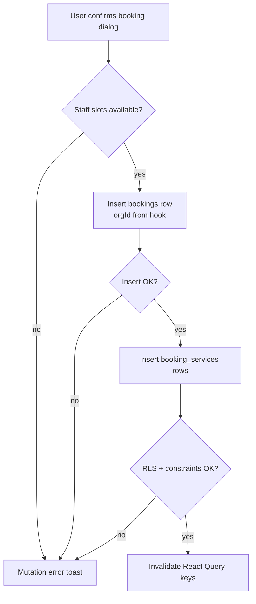

### 5.3 Public booking path (exception)

`PublicBookingPage` creates `customers` (by phone dedupe) and inserts `bookings` / `booking_services` **without** passing `organization_id` in the shown insert payload (unlike staff `BookingPage`). Whether this is safe depends on **live RLS policies and column defaults** on the deployed database (not fully represented in the four SQL files under `supabase/migrations/`). Treat this as a **mandatory review item** when hardening multi-tenant isolation.

---

## 6. Subscription and feature gating

### 6.1 Plan and feature matrix (client)

`src/hooks/useSubscription.ts` maps each `Feature` to a **minimum** `SubscriptionPlan` (`starter` < `professional` < `enterprise`). Examples: `pos_payments` → professional; `multi_branch`, `payroll`, `advanced_analytics` → enterprise.

### 6.2 Fetching subscription

`useSubscription` loads `organization_members` then `subscriptions` for that `organization_id`, returning plan, status, `business_type`, trial dates.

### 6.3 Feature gate logic (including the important `if` / `else`)

`FeatureGate` component:

1. If `useIsManagement()` → **render children unconditionally** (management bypass).  
2. Else if `useHasFeature(feature)` → render children.  
3. Else if custom `fallback` → render fallback.  
4. Else show locked UI with link to `/select-plan`.  

`RouteFeatureGate` wraps route content with `FeatureGate` so deep links cannot skip UI gating for non-management users.

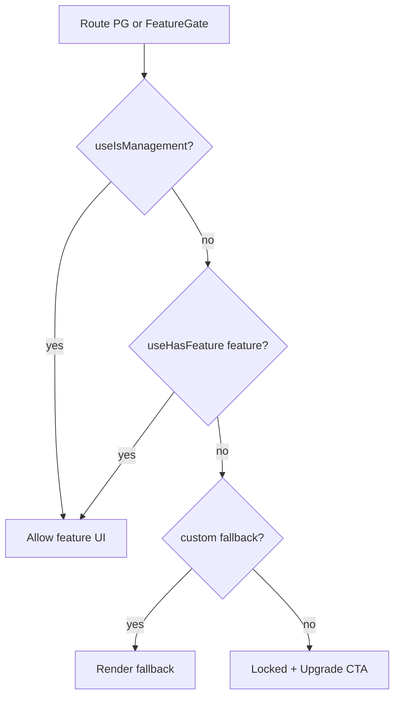

**Security note:** this is **entirely client-side enforcement** for navigation and component visibility. **Authoritative enforcement** must be **RLS policies** (and optional Edge Functions with service role) on every sensitive table. Management bypass means CEO/director/branch_manager users **trust** the UI to reach routes that still rely on Postgres for data access — if RLS is misconfigured, they could see or mutate other tenants’ rows.

### 6.4 Plan selection flow

`SelectPlanPage`:

- Requires `selectedPlatforms.length > 0` before showing plans.  
- On plan click: loads `organization_id` from `organization_members`, then `update subscriptions` setting `plan`, `business_type` (from `platformsToBizType`), `status: trial`, trial end timestamps, invalidates `["subscription"]` query, updates business category context, navigates `/dashboard`.  

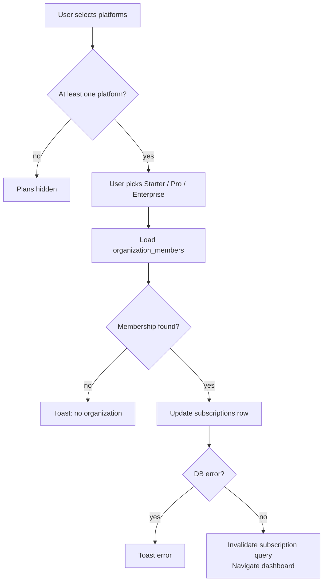

---

## 7. Role system and “portal view” simulation

`useUserRole` loads all `user_roles` for the user. `useHighestRole` walks a fixed hierarchy: `ceo` → `director` → `branch_manager` → `senior_barber` → `junior_barber` → `receptionist` → `customer`.

**Executive portal simulation:** if the user has an executive role (`ceo` / `director`) and `localStorage` contains `staff_portal_view`, `getEffectiveRoles` **replaces** their roles with a single simulated role (`branch_manager`, `receptionist`, or `senior_barber`) for `useIsManagement`, `useIsStaff`, and `useHighestRole`. That drives sidebar sections in `AppLayout` without changing database roles.

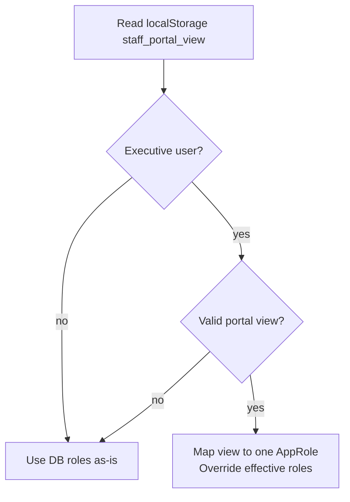

---

## 8. Data model (PostgreSQL)

### 8.1 Source of truth in the repo

- **Canonical column-level schema** for the TypeScript app: `src/integrations/supabase/types.ts` (generated).  
- **Partial DDL** checked into git: `supabase/migrations/*.sql` (organizations, subscriptions, branding, audit, reviews, schedules, waitlist, notifications, storage policies, etc.).  

Many tables appear in `types.ts` but **do not** have `CREATE TABLE` in the repo migrations (they may exist only on the hosted Supabase project). Treat migrations in git as **incomplete** relative to production until a full dump or migration history is exported.

### 8.2 Table inventory (from `types.ts` `Tables`)

| Domain | Tables |
|--------|--------|
| Tenancy & billing | `organizations`, `organization_members`, `subscriptions` |
| Identity & RBAC | `profiles`, `user_roles`, `customers` |
| Operations | `branches`, `staff`, `staff_schedules`, `services`, `bookings`, `booking_services`, `waitlist`, `qr_scans` |
| Commerce | `transactions`, `inventory`, `retail_products`, `gift_cards`, `gift_card_redemptions`, `tips`, `combo_discounts`, `service_packages`, `customer_packages`, `promotions` |
| CRM & growth | `referrals`, `reviews`, `loyalty_rewards`, `enquiries` |
| Compliance & content | `consent_forms`, `audit_log`, `notifications`, `staff_chat_messages` |
| Mode-specific | `coverage_zones`, `patient_intake`, `aftercare_instructions`, `session_notes`, `progress_tracking` |
| Finance misc | `expenses` |

### 8.3 Entity relationship (conceptual)

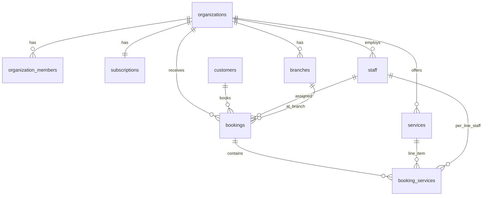

### 8.4 Database functions (RPC) exposed in types

Including: `check_staff_availability`, `get_user_business_type`, `get_user_organization_id`, `get_user_plan`, `has_role`, `is_management`, `is_staff`, `user_org_match`. These are the **server-side guardrails** that RLS policies should align with.

### 8.5 Known schema drift risks (repo vs types vs migrations)

| Area | Observation |
|------|----------------|
| `audit_log` | Migration `20260331030000_audit_log_storage_realtime.sql` uses columns like `table_name`, `record_id`, `old_data`, `new_data`; `types.ts` uses `entity_type`, `entity_id`, `details`, `user_id` NOT NULL. Deployed DB must match **one** shape or inserts/selects will fail. |
| `subscriptions` | Initial migration omits `business_type`; generated types expect `business_type` enum. Production likely added columns via dashboard or other migrations not in git. |
| `reviews` policies | Migration references `is_management(auth.uid())`; ensure function exists in same migration chain. |

---

## 9. Key end-to-end data flows (Mermaid)

### 9.1 Staff booking creation (happy path)

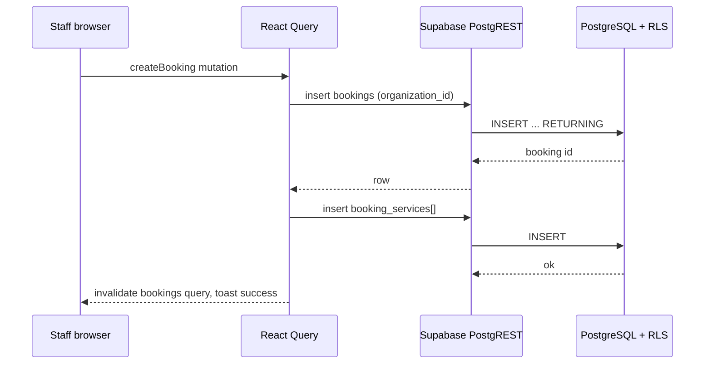

### 9.2 SMS reminder Edge Function (`send-reminders`)

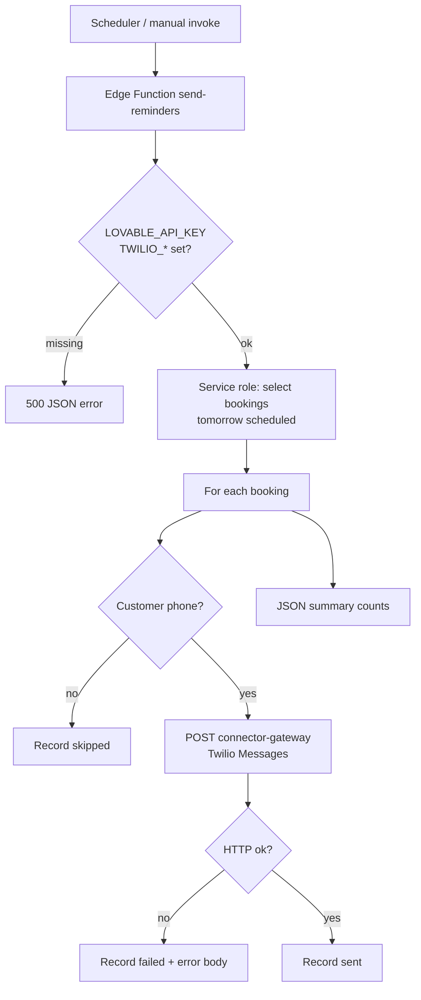

**Choke points:** sequential `for` loop with `await fetch` per booking (no internal batching); Twilio / gateway latency dominates; Edge Function **CPU time** limits; **cold start** on first invocation after idle.

### 9.3 Demo data fallback (UX vs truth)

`useDemoFallback` returns **synthetic** arrays from `lib/demoData.ts` when Supabase returns empty arrays — **without** an on-screen banner.

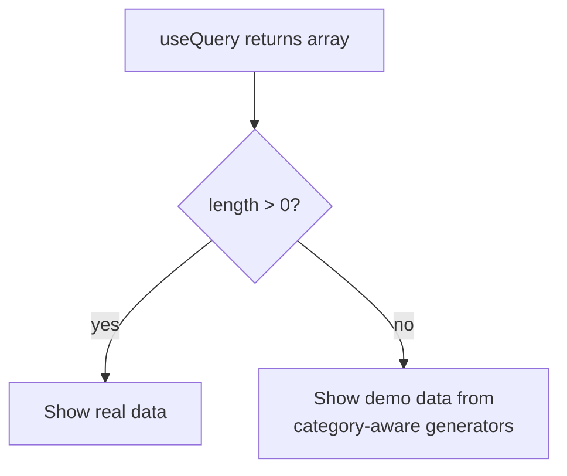

**Risk:** operators may believe production data exists when viewing **demo** charts or QR logs. For audits, disable or clearly label demo mode.

---

## 10. Infrastructure, cost drivers, cold starts, and choke points

This section maps **this repository’s actual dependencies** to operational cost and failure modes. Figures are **order-of-magnitude planning anchors** in KES; tune to your Supabase plan, Twilio volume, and hosting choice.

### 10.1 Billable components

| Component | What drives cost | Cold start / choke notes |
|-----------|------------------|---------------------------|
| **Supabase** | Database size, MAU auth, stored data egress, Edge invocations, Storage | PostgREST is always warm; **Edge Functions** cold start (hundreds of ms to few s) on scale-to-zero tiers; **Realtime** connections per tab |
| **Twilio SMS** | Per segment per country | `send-reminders` is **O(n)** HTTP calls in a loop — large tomorrow-booking lists hit **function timeout** and **rate limits** |
| **Lovable connector** | Bundled / metered per project | Hard dependency in `send-reminders`; if gateway is slow, reminders lag |
| **Frontend hosting** | Static asset bandwidth | Vite build → static files; no SSR in repo — SEO for marketing pages depends on host/prerender strategy |
| **Auth email** | Supabase default or custom SMTP | Signup confirmation deliverability affects funnel |

### 10.2 Application-level choke points

1. **Client-only feature gating** — fast to ship; must be doubled by RLS for security and by billing webhooks for revenue integrity.  
2. **N+1 patterns** — many pages issue multiple queries; acceptable early stage; becomes latency under concurrent staff.  
3. **`db.from` escape hatch** — `(supabase as any).from(table)` disables compile-time table checks; schema renames break at runtime.  
4. **Single-org hooks** — `.single()` on membership breaks if multiple memberships are introduced without code changes.  
5. **Public booking without explicit `organization_id`** — tenant resolution might rely on RLS + sessionless anon policies; verify carefully for **cross-tenant** risk.  
6. **Reminder function** — no dead-letter queue in-repo; partial sends require parsing JSON logs.  
7. **Management bypass** — UX shortcut; not a substitute for org-scoped RLS on reads/writes.  

### 10.3 Scaling path (from current SPA toward blueprint architecture)

| Stage | Current repo | Blueprint (PDF) delta |
|-------|--------------|------------------------|
| Now | SPA + Supabase | Already multi-tenant at DB |
| Growth | Add read replicas via Supabase tier; cache subscription in edge middleware | Introduce dedicated queue worker for SMS batches |
| Retail-heavy (`products`) | POS + inventory + `shop-orders` traffic concentrated in business hours | Split order ingestion and reconciliation workers; isolate high-write inventory paths |
| Solo-focused (`solo_pro`) | Single-operator flows with lower org complexity | Keep lightweight defaults; avoid over-provisioned branch/payroll modules |
| Platform split | Extract payments webhooks to stateless workers | Laravel modular monolith + Horizon |
| Realtime | Supabase Realtime for `notifications` | Soketi / Pusher for chat-scale fanout |

### 10.4 Cost scenario table (illustrative — engineering planning)

| Stage | Monthly band (KES) | Users / orgs (indicative) | Notes |
|-------|-------------------|---------------------------|--------|
| Dev / pilot | ~5k–15k | Tens | Supabase free/low + minimal SMS |
| Single-region MVP | ~20k–45k | Hundreds | Paid Supabase, SMS volume, small always-on Edge |
| Growth | ~50k–120k | Low thousands | Higher DB compute, Twilio campaigns, storage |
| Scale-out | 120k+ | Many thousands | Read replicas, connection pooler (Supavisor), separate worker for reminders |

Strategic gap vs the PDF’s AWS Lightsail table: **Supabase bundles** DB + Auth + API; you trade **ops simplicity** for **less granular** cost line items until you outgrow the platform or negotiate enterprise.

---

## 11. Security and compliance checklist (technical)

- **RLS:** verify every tenant table has policies consistent with `organization_id` (or equivalent) for `authenticated` and `anon` roles as intended.  
- **Service role:** Edge Functions use service role — **never** expose that key to the browser.  
- **Storage paths:** branding policies use `auth.uid()` folder prefix; confirm same pattern for `receipts` private bucket.  
- **CORS on Edge:** `send-reminders` allows `*` origin — acceptable for cron-to-function, risky if invoked from arbitrary browsers with secrets.  
- **Audit log:** unify schema and ensure inserts from app code match RLS (`is_staff` insert, `is_management` read in migration snippet).  

---

## 12. How to keep this document accurate

1. Regenerate `src/integrations/supabase/types.ts` after every schema migration.  
2. Export full SQL migration history from Supabase into `supabase/migrations/` so git matches production.  
3. Add architecture decision records (ADRs) when introducing Laravel/Next.js services described in the PDF blueprint.  
4. For each new page that mutates data, add a one-line note here or in an ADR: **which table**, **which org key**, **which RLS policy** applies.

---

## Document control

| Field | Value |
|-------|--------|
| Repository | `barber-house-charm` |
| Primary entrypoints | `src/App.tsx`, `src/lib/db.ts`, `src/hooks/useAuth.tsx`, `src/hooks/useSubscription.ts` |
| Database artifacts | `supabase/migrations/`, `src/integrations/supabase/types.ts` |
| Edge Functions | `supabase/functions/send-reminders/index.ts` |

© 2026 Haus of Grooming OS. All rights reserved.
