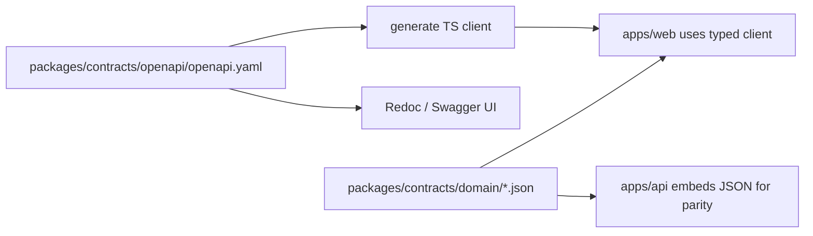

# 01 — Monorepo Architecture

## Layout

```text
haus-of-wellness/
  apps/
    web/                      # Next.js 14+ (App Router) — staff app, portal, marketing, shop
    api/                      # Go + Fiber modular monolith
    calling/                  # (later) Go or Node WebRTC signaling service
  packages/
    contracts/                # OpenAPI spec + generated TS client + shared domain JSON
      openapi/                # openapi.yaml (source of truth for the HTTP surface)
      ts/                     # generated TS types + fetch client (consumed by web)
      domain/                 # mode-terms.json, nav/*.json, features.json, pricing.json
    ui/                       # (optional) shared shadcn primitives + design tokens
  infra/
    docker/                   # docker-compose, Dockerfiles, nginx
    migrations/               # SQL migrations (golang-migrate) — see note
    terraform/                # (later) cloud infra
  .cursor/rules/              # agent rules (mirrors ../rules intent)
  package.json                # pnpm workspace root
  pnpm-workspace.yaml
  turbo.json                  # Turborepo pipeline (build/lint/test/typecheck)
  go.work                     # Go workspace linking apps/api (+ calling later)
```

## Tooling decisions

| Concern | Choice | Rationale |
|---------|--------|-----------|
| JS package manager | **pnpm** workspaces | Fast, strict, good monorepo story |
| Task runner | **Turborepo** | Cache build/lint/test across apps + packages |
| Go workspace | **`go.work`** | Multi-module, lets `calling` service join later |
| API contract | **OpenAPI 3.1** in `packages/contracts/openapi` | One spec → TS client (web) + server-side validation reference |
| TS client gen | `openapi-typescript` + thin fetch wrapper | Mirrors prototype's `lib/db.ts` ergonomics |
| Migrations | **golang-migrate** SQL files in `infra/migrations` | Plain SQL, reviewable, GORM `AutoMigrate` only in dev |
| Lint/format | ESLint + Prettier (web); `golangci-lint` + `gofumpt` (api) | Standard |
| Tests | Vitest + Playwright (web); Go `testing` + `testify` + `testcontainers-go` (api) | Integration tests hit a real Postgres |

## Why GORM (confirmed) — and the guardrails

GORM is the chosen ORM. It is fast to build with, but to avoid its footguns we **mandate**:

- A **global tenant scope** applied to every tenant-scoped model (see `05-auth-rbac-tenancy.md`). No raw `.Find()` without the org scope on tenant tables.
- **No `AutoMigrate` in staging/prod.** Schema changes ship as reviewed SQL migrations via golang-migrate. `AutoMigrate` is dev-only convenience.
- **Repositories**, not models, are called from services. Services never see `*gorm.DB` directly except through a repository interface — keeps queries testable and scope-enforced.
- Disable implicit `Preload("*")`. Eager-load explicitly to prevent N+1 and over-fetch.

## Shared contracts flow



Mode terms, nav manifests, feature→plan map, and pricing constants are **data**, not code. Both apps read the same JSON so the sidebar (web) and entitlement checks (api) can never drift.

## Hosting (MVP → scale)

- **MVP:** single **VPS** (Hetzner / DigitalOcean) running **Docker Compose**: `web` (Next.js), `api` (Fiber), `worker` (asynq), Postgres, Redis, MinIO, and **nginx/Caddy** as TLS-terminating reverse proxy with **wildcard cert** for `*.hausofwellness.com` (subdomain tenancy).
- Compose profiles separate app vs data services; named volumes for Postgres/MinIO; nightly `pg_dump` to object storage.
- **Scale path:** same Docker images move to k8s/ECS later; externalize Postgres (managed) + Redis + R2/S3 first, then split worker fleet.

## Environments

| Env | Data services | Notes |
|-----|---------------|-------|
| `local` | docker-compose Postgres + Redis + **MinIO** | seed + demo data; Pesapal sandbox; `*.lvh.me` for subdomains |
| `ci` | ephemeral Postgres + MinIO (testcontainers) | migrations + tests only |
| `staging` | VPS Compose (or managed PG) | masked data, provider sandboxes, real wildcard TLS |
| `production` | VPS Compose → managed PG + read replica later | backups + PITR; OpenFloat live keys |
