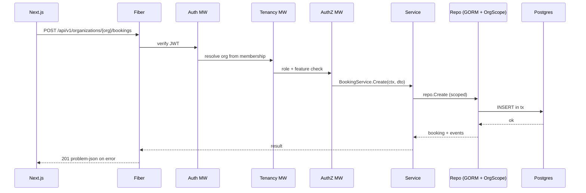

# 03 — Backend (Go + Fiber)

Modular monolith in Go using **Fiber v2** for HTTP, **GORM** for persistence, **Redis** for cache/queue/locks. Replaces both the docs' Laravel target and the prototype's Supabase backend.

## Package layout

```text
apps/api/
  cmd/
    api/main.go               # wires config, db, redis, router, modules
    worker/main.go            # asynq worker process
    migrate/main.go           # golang-migrate runner
  internal/
    platform/
      config/                 # env config (viper/envconfig)
      database/               # gorm.Open, pgx pool, tenant scope helper
      redis/                  # client, locks, idempotency
      httpx/                  # error envelope (RFC 7807), responder, pagination
      auth/                   # jwt issue/verify, password hashing (argon2id), TOTP
      tenancy/                # ResolveOrganization middleware + OrgScope
      authz/                  # RBAC (casbin or policy funcs), feature gate middleware
      realtime/               # websocket hub, channel auth
      queue/                  # asynq client + task definitions
      validate/               # request binding + go-playground/validator
    modules/
      auth/                   # register, login, refresh, 2fa, password reset
      tenancy/                # organizations, members, branches
      billing/                # subscriptions, plans, features, Pesapal SaaS charge
      ledger/                 # double-entry ledger, tenant_wallets, balances
      payouts/                # OpenFloat disbursements, payout statements
      booking/                # bookings, booking_services, availability, queue, waitlist
      pos/                    # transactions, tenders, reconciliation, gift cards
      crm/                    # customers, loyalty, referrals, reviews
      staff/                  # staff, schedules, commissions, payroll, attendance (qr)
      inventory/              # inventory, consumption, suppliers, retail_products
      growth/                 # promotions, packages, loyalty rewards, marketing, gallery
      ops/                    # tips, staff_chat, notifications, audit_log
      modes/                  # coverage_zones, patient_intake, aftercare, session_notes, progress
      reporting/              # aggregates, exports
      features/               # feature registry, EffectiveFeatures resolver, flags
      platform/               # platform-admin console: tenants, plans, feature flags, payout oversight, audit (cross-tenant, /api/v1/platform/*)
      integrations/           # pesapal (orders+IPN+openfloat), whatsapp (Meta), sms (Africa's Talking), maps (Google), ai insights, media (MinIO/S3)
  pkg/                        # exported helpers if any
```

### Module anatomy (every module)

```text
modules/booking/
  handler.go      # Fiber handlers — bind, authorize, call service, respond
  service.go      # business rules (availability, conflict, transitions)
  repository.go   # GORM queries (interface + impl), tenant-scoped
  model.go        # GORM structs (or import from platform/models)
  dto.go          # request/response shapes matching OpenAPI
  events.go       # domain events published to the bus
  routes.go       # RegisterRoutes(router fiber.Router, deps)
```

**Rule:** handlers never touch GORM; services call repository interfaces; cross-module writes go through services + domain events, never another module's repo.

## HTTP conventions

- Base path `/api/v1`. Resource style: `/api/v1/organizations/{org}/bookings`.
- Errors: **RFC 7807** `application/problem+json`, one envelope company-wide.
- Pagination: cursor-based for high-churn (`bookings`, `notifications`); offset for small admin lists.
- Filtering: `filter[status]=scheduled&filter[branch_id]=...`.
- Idempotency: `Idempotency-Key` header on payment + webhook routes (Redis `SETNX`).

## Middleware stack (order matters)

```go
app.Use(requestid.New())
app.Use(recover.New())
app.Use(logger.New())            // structured JSON, correlation id
app.Use(cors.New(corsCfg))
// per-group:
v1 := app.Group("/api/v1")
v1.Use(auth.JWT())               // verifies access token / session
v1.Use(tenancy.ResolveOrganization()) // sets org from membership, NOT body
// route-level:
group.Use(authz.RequireRole("ceo","director"))
group.Use(authz.RequireFeature("pos_payments"))
```

## Request lifecycle



## Config & startup

- Config via env (`envconfig`): DB DSN, Redis URL, JWT secrets, M-Pesa creds (from secrets manager, never git).
- `/health` checks DB + Redis; used by load balancer + uptime checks.
- Graceful shutdown: drain Fiber, close GORM pool, stop asynq workers.

## Why Fiber

Fast (fasthttp), Express-like ergonomics that map cleanly from the prototype's mental model, mature middleware ecosystem. Note: fasthttp `Ctx` is not the std `net/http` context — wrap external SDKs that expect `*http.Request` accordingly, and always derive a `context.Context` for DB/Redis calls.
