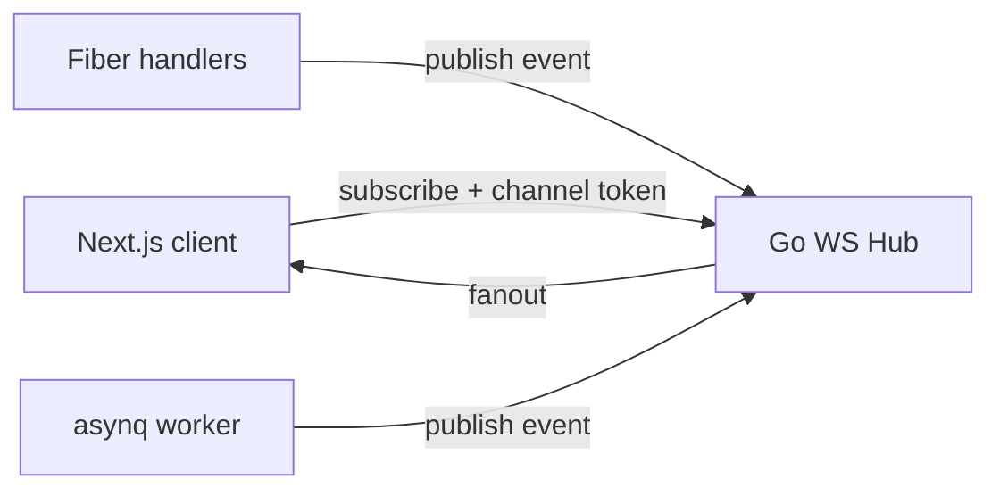
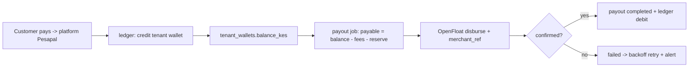
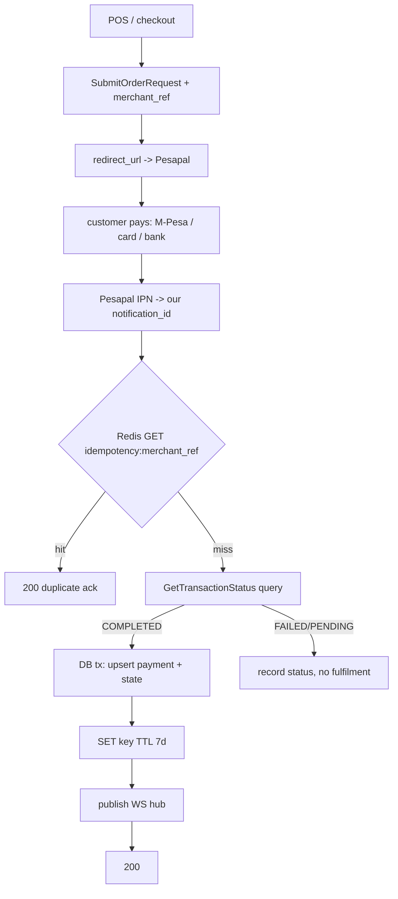

# 07 — Realtime, Background Jobs & Integrations

Supabase Realtime + Edge Functions are replaced by a Go WebSocket hub + an asynq worker fleet.

## Realtime

| Concern | Choice |
|---------|--------|
| Transport | Go WebSocket hub (`nhooyr.io/websocket` or `fasthttp/websocket`); optional Centrifugo if scale demands |
| Channels | `org.{id}.queue`, `org.{id}.chat`, `user.{id}.notifications` |
| Auth | client calls `POST /api/v1/realtime/token`; server issues a short-lived signed channel token; hub validates membership before subscribe |
| Client | TanStack Query patch (`setQueryData`) on event, or targeted `invalidateQueries` |

Realtime use cases (from prototype): walk-in **queue board**, **staff chat**, **notifications**, live POS payment confirmation.

## Background jobs (replaces Edge Functions)

**asynq** (Redis-backed) with separate queues + concurrency:

| Queue | Tasks |
|-------|-------|
| `notifications` | booking confirmation, 24h/1h reminders, push |
| `integrations` | Pesapal reconciliation, WhatsApp send, SMS batch |
| `payouts` | OpenFloat disbursements + status reconciliation (idempotent, locked per tenant) |
| `reports` | CSV/PDF exports, materialized-view refresh |
| `default` | misc |

- **Idempotent jobs** for payments: `asynq.Unique` + Redis lock; safe replays.
- **Scheduler** (`asynq` periodic or a `cmd/scheduler`) enqueues reminder batches and dunning — never an unbounded synchronous loop.
- Failed jobs → DLQ + alert + inspection playbook.

## Integrations

### Payments — Pesapal (single gateway, platform-collect model)

**Pesapal** is the one payment gateway. It aggregates **M-Pesa (STK), card, and bank transfer**, so we do **not** integrate Safaricom Daraja directly. Used for both payment planes:

- **Customer → tenant** (POS / online booking deposits).
- **Tenant → platform** (SaaS subscription billing).

**Money-flow model = platform collects, then disburses.** All customer payments land in the **platform's** Pesapal account. The tenant sees "payment received" instantly (we record it against their wallet/ledger). The platform later **programmatically disburses** the tenant's balance (minus SaaS fee / commission) to the tenant via **Pesapal OpenFloat**. This makes us a marketplace/aggregator and requires a **double-entry ledger + payouts** (see below + `04-data-postgres-gorm.md`).

Pesapal API v3 flow:

1. **Auth:** `POST /api/Auth/RequestToken` (consumer key + secret) → bearer token, cache in Redis until expiry.
2. **Register IPN once per env:** `POST /api/URLSetup/RegisterIPN` → store `ipn_id`.
3. **Submit order:** `POST /api/Transactions/SubmitOrderRequest` with `id` (our merchant ref = idempotency key), amount, currency, `callback_url`, `notification_id` (ipn_id) → returns `order_tracking_id` + `redirect_url`.
4. Client completes payment in Pesapal redirect/iframe (picks M-Pesa or bank).
5. **IPN callback:** Pesapal calls our `notification_id` URL with `OrderTrackingId` + `OrderMerchantReference`.
6. **Verify status (pull, don't trust push):** on IPN, call `GET /api/Transactions/GetTransactionStatus?orderTrackingId=...` → authoritative status.
7. On `COMPLETED`: update `transactions` + booking/subscription state in a tx, publish to WS hub for POS UI.

8. **Credit the tenant ledger** in the same DB tx: write `transactions` row + double-entry `ledger_entries` (debit platform clearing, credit tenant wallet) → `tenant_wallets.balance_kes` increases. Tenant UI shows funds received immediately.

Hardening:

- **Idempotency** keyed on our `OrderMerchantReference` (Redis `SETNX`, TTL 7d) — IPN may fire multiple times.
- **Never trust the IPN body for status.** Always re-query `GetTransactionStatus`.
- Rate-limit + verify the IPN endpoint belongs to a known order; log unknown refs as security events.
- Store `order_tracking_id`, `merchant_reference`, gateway, and resolved `payment_method` (`mpesa|card|bank`) on `transactions`.

### Disbursement — Pesapal OpenFloat (payouts to tenants)

Platform owes each tenant their collected balance minus fees. A scheduled `payouts` job (or on-demand from admin) disburses via Pesapal **OpenFloat** API to the tenant's M-Pesa / bank.

- Compute payable = `tenant_wallets.balance_kes` − pending SaaS fees − held reserve. Never disburse more than the available, reconciled balance.
- Create a `payouts` row (`pending`) → call OpenFloat disburse with a unique `merchant_reference` (idempotency) → on confirmation move to `completed` + write ledger entries (debit tenant wallet, credit platform payout clearing). On failure → `failed`, retry with backoff, alert.
- **Idempotency + locks:** Redis lock per tenant during payout calc; `merchant_reference` SETNX so a retried job never double-pays. Reconcile OpenFloat status by query, not push.
- Ledger is the source of truth for balances; OpenFloat is the rail. Every disbursement is auditable end-to-end.

### WhatsApp / SMS

- **SMS:** **Africa's Talking** (Kenya-focused) — reminders, OTP fallback, campaigns.
- **WhatsApp:** **Meta WhatsApp Cloud API** — confirmations, reminders, bounded bot intents (status, reschedule).
- Keep a `Notifier` interface (`SendSMS`, `SendWhatsApp`) with per-provider adapters so vendors can swap without touching callers.
- Inbound: `POST /webhooks/whatsapp` validates Meta signature → dispatch `ProcessWhatsAppMessage` job.
- Outbound: queued jobs only, never inline in the HTTP request beyond enqueue. Respect consent/unsubscribe flags + provider template rules.

### Media (S3-compatible — MinIO dev/test, R2/S3 prod)

- **Local + test + CI use MinIO** (S3-compatible, runs in docker-compose / testcontainers). Production uses Cloudflare R2 or AWS S3. Same S3 SDK + bucket layout across all envs — only the endpoint/creds change.
- Upload flow: client requests signed URL (`POST /uploads/signed-url`) → direct PUT to MinIO/S3 → `POST /media/confirm` attaches metadata. Store original + thumbnail keys for gallery.
- Use the AWS Go SDK v2 with a custom endpoint resolver pointing at MinIO in non-prod; path-style addressing for MinIO.

### AI insights (optional, first-party)

- `POST /api/v1/organizations/{org}/insights` (feature-gated) enqueues a job calling OpenAI/Gemini with org-scoped or pooled keys, **budget caps**, and PII minimization. No third-party AI gateway.

### Maps — Google Maps (mobile mode)

- **Coverage zones** (mobile mode) use **Google Maps**: Geocoding API (address → lat/lng), Maps JS for zone polygons/radius, Directions/Distance Matrix for dispatch routing/travel time.
- `coverage_zones` keeps `center_lat/lng + radius_km` and optional `area_polygon`; on booking, geocode the customer address and test membership → apply `surcharge_kes`.
- Frontend: load the Maps JS lazily inside client components only (`07`/`web-best-practices` rule). API key restricted by HTTP referrer (web) + IP (server geocoding); server-side geocoding keeps the key off the client where possible.

### Calling (later)

- Extracted service (`apps/calling`) for WebRTC signaling; persists `call_logs` to Go via signed webhook. Out of scope for initial phases.
