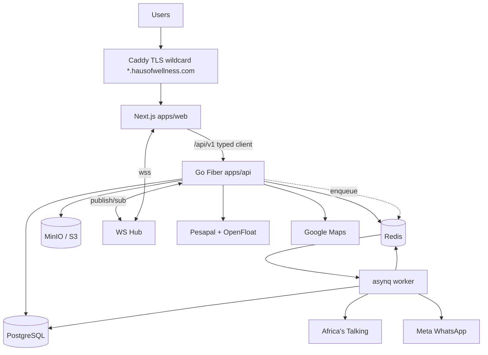

# 11 — Master Build Plan (combined, phased)

The single end-to-end plan. Combines scope (`00`), monorepo (`01`), frontend (`02`), backend (`03`), data (`04`), auth/tenancy (`05`), billing (`06`), realtime/jobs/integrations (`07`), and design (`10`) into one phased delivery. Read the topic docs for depth; this file is the execution sequence.

## Locked decisions (recap)

| Area | Decision |
|------|----------|
| Frontend | Next.js (App Router) + TS + Tailwind + shadcn/ui — port of `../barber-house-charm` |
| Backend | Go + **Fiber** + **GORM** modular monolith |
| Data | PostgreSQL 16 + Redis 7; asynq jobs; Go WebSocket hub |
| Payments | **Pesapal** collect (M-Pesa/card/bank) → double-entry ledger → **OpenFloat** payouts |
| Storage | **MinIO** dev/test/CI, R2/S3 prod |
| Messaging | SMS **Africa's Talking**, WhatsApp **Meta Cloud API** |
| Maps | **Google Maps** (mobile coverage zones) |
| Tenancy | **Subdomain** `{slug}.hausofwellness.com`; org re-validated server-side |
| Hosting | **VPS + Docker Compose** (MVP) → k8s later; Caddy wildcard TLS |
| Auth | httpOnly cookie + JWT refresh; TOTP 2FA |
| Scope | Full **9-mode** multi-tenant SaaS; wellness flagship identity |

## Architecture at a glance



## Cross-cutting foundations (built in Phase 1, enforced forever)

These are not a phase you "finish" — they gate every later slice (see Definition of Done in `09`):

1. **Tenant isolation** — `ResolveOrganization` middleware + GORM `OrgScope` (`05`, `01-security-tenancy.mdc`).
2. **Contracts-first** — OpenAPI + `domain/*.json` shared by both apps (`01`, `contracts-and-domain.mdc`).
3. **Structured logging + observability** — request in/out, external calls, `request_id` everywhere (`logging-observability.mdc`).
4. **Web best practices** — PWA, pagination, lazy load, caching, CWV, a11y (`web-best-practices.mdc`).
5. **Financial-grade ledger** — append-only, balanced, reconciled (`04`, `06` compliance flag).
6. **Feature registry** — every capability is a flag; add/remove without breaking; resolved server-side into `/me` (`12`, `feature-flags.mdc`).

---

## Phase 0 — Lock the model & contracts (≈1 week)

**Goal:** freeze the domain so both apps build against the same truth.

- Extract from prototype into `packages/contracts/domain/`:
  - `mode-terms.json` (9 modes + mixed) from `MODE_TERMS`.
  - `nav/*.json` manifest keyed by `{mode, role}` (replaces `BARBER_NAV…PRODUCTS_NAV`; build real `solo_pro` + merged multi-mode).
  - `features.json` (single feature→min-plan map).
  - `pricing.json` (`BASE_MONTHLY_KES`, cycles/discounts, currencies).
- Draft `openapi/openapi.yaml`: auth, `/me`, organizations, bookings slice. Error envelope = RFC 7807.
- Generate TS client (`openapi-typescript`) into `packages/contracts/ts`.
- **Exit:** contracts compile; web + api both import shared JSON; TS client generates clean.

## Phase 1 — Platform skeleton & foundations (≈2 weeks)

**Goal:** real login → role redirect → empty tenant-scoped dashboard, with all cross-cutting foundations wired.

**Infra**
- Monorepo: pnpm workspaces + Turborepo + `go.work`.
- `infra/docker/compose.yml`: postgres, redis, minio, api, web, worker, caddy (wildcard TLS, `*.lvh.me` local).
- `cmd/migrate` (golang-migrate), `cmd/seed`, `cmd/worker`, `cmd/api`.

**Backend (`apps/api`)**
- `platform/`: config (envconfig), GORM open + pgx pool, Redis client, `httpx` (problem-json + responder + pagination), `slog` JSON logger, request-logger middleware, `requestid`, `recover`.
- `auth` module: register (signup bootstrap tx), login, refresh, logout, forgot/reset, `GET /me` (user, roles, active_org, subscription, features[]). argon2id; httpOnly cookie + JWT.
- `tenancy` module: organizations, members, branches; `ResolveOrganization` middleware; `OrgScope`.
- `authz`: role helpers + `RequireRole` / `RequireFeature`.
- `features` module: `features` table synced from `features.json`, `EffectiveFeatures(orgID)` resolver (kill-switch → override → plan → default → dependencies), Redis cache; `/me` returns `features[]`.
- `/health` + `/metrics`; OTel + Prometheus wiring.

**Frontend (`apps/web`)**
- App Router groups: `(marketing)`, `(auth)`, `(portal)`, `(dashboard)`, plus `onboarding`, `select-plan`.
- `middleware.ts`: subdomain → `x-tenant-slug`, session refresh, request id.
- Port design tokens (`globals.css` + `tailwind.config.ts`, all theme classes incl. new `theme-products`), `next/font`.
- `lib/api-client.ts` (typed), `useAuth`, `useSubscription`, `useUserRole`, `useBusinessCategory`, `useOrganizationId`, `useFeature` + `<Feature>` guard.
- Auth pages, protected layouts calling real `/me`, role redirect, empty dashboard shell + mode-aware sidebar from `nav/*.json`.
- PWA manifest + service worker baseline.

**CI:** golangci-lint, gosec, govulncheck, ESLint, typecheck, unit tests, build.

**Exit:** sign up → org/trial created → login → redirect by role → mode-themed empty dashboard; another org's data unreachable (isolation test passes).

## Phase 2 — Bookings + scheduling + notifications (≈2–3 weeks)

**Backend:** `booking` module — bookings, `booking_services`, availability (`CheckAvailability` overlap query), status state machine, walk-in queue, waitlist. `staff` schedules. Domain events `BookingConfirmed/Cancelled`.
**Jobs:** `notifications` queue — confirmation + 24h/1h reminders via `Notifier` (Africa's Talking SMS, Meta WhatsApp), sandbox.
**Realtime:** WS hub + `realtime/token`; `org.{id}.queue` fanout on walk-in changes.
**Frontend:** staff booking board (new shared `<DataTable>` + calendar client component), schedule view, queue board (live), public booking widget at `(public)/book/[orgSlug]` (signed org token + Turnstile, minimal JS).
**Exit:** create/modify/cancel booking; availability blocks conflicts; live queue updates; reminder enqueued; public booking works scoped to org.

## Phase 3 — POS, Pesapal, ledger & payouts (≈3–4 weeks)

**Backend:**
- `pos` module — `transactions`, tenders (cash/Pesapal), gift cards, reconciliation; feature gate `pos_payments`.
- `integrations/pesapal` — `auth` (token cache), `order` (SubmitOrderRequest), `ipn` (RegisterIPN + handler), `status` (GetTransactionStatus). Idempotent on `OrderMerchantReference`; verify via status query, never IPN body.
- `ledger` module — double-entry `ledger_entries`, `tenant_wallets`; payment credits wallet in same tx as `transactions` write.
- `payouts` module — OpenFloat disbursement job (Redis lock per tenant, idempotent merchant ref, status reconciled), `payouts` + `payout_items`, statements.
- Server computes all amounts; `Idempotency-Key` on payment routes.

**Frontend:** POS screen (cart, tender, Pesapal redirect/iframe, receipt), reconciliation, tenant wallet/earnings view showing "received" + payout history. Upgrade prompt on gated routes.
**Exit:** sale via M-Pesa/card/bank through Pesapal → tenant wallet credited → test OpenFloat disbursement settles → ledger balances → replays safe.

## Phase 4 — CRM, inventory, HR surfaces (≈3 weeks)

**Backend:** `crm` (customers, loyalty, referrals, reviews), `inventory` (inventory, consumption, suppliers, retail_products), `staff` commissions/tips/payroll/attendance (qr_scans). Heavy reads → read-model tables/materialized views refreshed by jobs.
**Frontend:** clients CRM (DataTable + detail drawer), loyalty, inventory + low-stock alerts, commissions, tips, payroll (async export → S3 signed download), QR clock/attendance.
**Exit:** loyalty accrues on completed booking; low-stock alert fires; payroll PDF generated async; tips/commissions reported.

## Phase 5 — Enterprise, mode screens & platform admin (≈4 weeks)

**Backend:** `tenancy` multi-branch; `ops` audit_log (append-only, partitioned), staff_chat, notifications; `reporting` advanced analytics (read replica + materialized views); API keys (enterprise). `modes` module: coverage_zones (+ Google geocode/membership/surcharge), patient_intake, aftercare, session_notes, progress_tracking; products store + shop-orders. **`platform` module** (`/api/v1/platform/*`, `RequirePlatformRole` + 2FA): tenants, plans, feature registry CRUD + flags + rollouts + per-org overrides, payout/OpenFloat oversight, `platform_audit_log`, system/maintenance.
**Frontend:** branches, audit log, scorecards, call-centre, branding; all 9 nav manifests live (incl. solo_pro + merged multi-mode); mode screens (dispatch + Google map for mobile, clinical for clinic, sessions for therapy, storefront/shop for products). **`(admin)` route group at `admin.hausofwellness.com`**: dashboard, tenants, subscriptions, **feature-management UI** (global kill-switch, rollout %, per-org overrides), payments/ledger/payouts oversight, compliance/KYC.
**Exit:** each mode renders correct nav/terms/theme/screens; enterprise gates enforced; coverage-zone surcharge via real geocoding; platform admin can flip a feature flag and tenants reflect it on `/me` refetch without a deploy; impersonation audited.

## Phase 6 — Hardening, compliance & scale (ongoing)

- k6 load tests on `/book` + Pesapal IPN; chaos drills; backup/restore + payout-reconciliation runbooks; pen-test remediation.
- **Compliance:** finalize CBK/PSP posture, AML/KYC on tenant onboarding, float/settlement T&Cs, hold periods (`06` flag) before real-money launch.
- PWA offline polish (mobile field staff); optional calling service (`apps/calling`); externalize Postgres/Redis/storage; split worker fleet; evaluate k8s.

---

## Dependency order (critical path)

```
Phase 0 contracts
  -> Phase 1 (auth + tenancy + logging + scope)   [gates everything]
       -> Phase 2 bookings (+ realtime, notifications)
       -> Phase 3 POS + ledger + payouts          [needs tenancy + transactions]
            -> Phase 4 CRM/inventory/HR           [loyalty needs bookings + transactions]
                 -> Phase 5 enterprise + modes
                      -> Phase 6 hardening + compliance
```

## Per-slice Definition of Done (every merge)

1. OpenAPI updated, TS client regenerated, `domain/*.json` in sync.
2. Go: validator on DTOs, `RequireRole`/`RequireFeature` where needed, repo `OrgScope` test, service unit tests, integration test on testcontainers Postgres.
3. Web: RSC prefetch or TanStack hooks with loading/error/**empty** states; a11y pass; lazy-load heavy widgets.
4. Logs: request in/out + external calls structured with `request_id`; no secret/PII leakage.
5. Idempotency documented for any payment/payout/webhook path; ledger balances asserted in tests.
6. Tenant-isolation test: org A cannot read/write org B on new endpoints.
7. Runbook entry for new env vars + failure modes; load-test ticket if hot path.

## Suggested team slicing

Each phase is a vertical slice ownable by a small pair (1 backend + 1 frontend) with shared contract edits reviewed first. Payments/ledger (Phase 3) and compliance (Phase 6) warrant senior + review focus given money + regulatory risk.
